# ⚙️ Section #11: `How React works behind the scenes`

---

## 📑 Table of Contents

---

## 🔧 01. Lesson 123 — _Project Setup and Walkthrough_

### 🧠 01.1 Context:

**Project Setup and Walkthrough** is the initial lesson that establishes the foundation of the project and provides an overview of its structure and functionality. This lesson is fundamental because:

#### Definition and Purpose

A **walkthrough** is a systematic review process of existing code to understand its architecture, data flow, and component structure. In this context, the project is designed to explore how React works internally, specifically focusing on component lifecycle, state management, and rendering.

#### Project Structure

The project uses a modern architecture based on:
- **Vite**: Ultra-fast build tool and dev server that provides HMR (Hot Module Replacement)
- **React 19.2.0**: The latest version of React with performance improvements and new features
- **TypeScript**: For type safety and better development experience
- **ESLint**: To maintain code quality and detect potential issues

#### Component Architecture

The project implements a tab system that demonstrates key concepts:

1. **App.tsx**: Root component that defines the data structure (`ContentItem[]`) and renders the `Tabbed` component
2. **Tabbed.tsx**: Container component that manages the active tab state (`activeTab`) and decides what content to display
3. **Tab.tsx**: Presentational component that represents an individual tab button
4. **TabContent.tsx**: Component that displays tab content with its own local state (`showDetails`, `likes`)
5. **DifferentContent.tsx**: Alternative component displayed when tab 4 is selected, demonstrating how component changes reset state

#### Data Flow

The data flow follows a top-down pattern:
- `App` passes `content` as a prop to `Tabbed`
- `Tabbed` manages the `activeTab` state and passes it to each `Tab`
- `TabContent` receives the specific `item` based on `activeTab`
- Each component can have its own local state (like `likes` in `TabContent`)

#### When to Use This Pattern

This design pattern is appropriate when:
- You need an interface with multiple views that share a common state
- You want to demonstrate how state is maintained or reset when changing components
- You're exploring component lifecycle and conditional rendering

#### Advantages

- **Separation of concerns**: Each component has a specific function
- **Reusability**: `Tab` can be used multiple times with different props
- **Maintainability**: Organized and easy-to-understand code
- **TypeScript**: Type safety prevents common errors

#### Disadvantages

- **Props drilling**: The `activeTab` state is passed through multiple levels
- **Local state**: State in `TabContent` is lost when switching tabs (intentional behavior for demonstration)
- **Hardcoded tabs**: Tabs are hardcoded instead of being dynamic based on content

#### Alternatives to Consider

- **Context API**: To avoid props drilling if the component tree grows
- **State Management Libraries**: Redux, Zustand, or Jotai for more complex applications
- **Dynamic components**: Generate tabs based on the `content` array instead of hardcoding them
- **Custom Hooks**: Extract state logic into reusable hooks

#### Connection to Main Theme

This setup is crucial because it sets the stage for exploring:
- How React renders components
- How state is maintained or reset between renders
- Component lifecycle and side effects
- Performance optimizations and re-rendering

### ⚙️ 01.2 Updating code according the context:

#### 01.2.1 Initial setup:

- `App.tsx`:

  ```tsx
  /* src/App.tsx */
  import Tabbed from "./components/Tabbed";

  export interface ContentItem {
    summary: string;
    details: string;
  }

  const content: ContentItem[] = [
    {
      summary: "React is a library for building UIs",
      details:
        "Dolor in reprehenderit in voluptate velit esse cillum dolore eu fugiat nulla pariatur. Occaecat cupidatat non proident, sunt in culpa qui officia deserunt mollit anim id est laborum.",
    },
    {
      summary: "State management is like giving state a home",
      details:
        "Lorem ipsum dolor sit amet, consectetur adipisicing elit, sed do eiusmod tempor incididunt ut labore et dolore magna aliqua. Excepteur sint occaecat cupidatat non proident, sunt in culpa qui officia deserunt mollit anim id est laborum.",
    },
    {
      summary: "We can think of props as the component API",
      details:
        "Ut enim ad minim veniam, quis nostrud exercitation ullamco laboris nisi ut aliquip ex ea commodo consequat. Duis aute irure dolor in reprehenderit in voluptate velit esse cillum dolore eu fugiat nulla pariatur.",
    },
  ];

  export default function App() {
    return (
      <div>
        <Tabbed content={content} />
      </div>
    );
  }
  ```

- `Tabbed.tsx`:

  ```tsx
  /* src/components/Tabbed.tsx */
  import { useState } from "react";
  import DifferentContent from "./DifferentContent";
  import Tab from "./Tab";
  import TabContent from "./TabContent";
  import type { ContentItem } from "../App";

  interface TabbedProps {
    content: ContentItem[];
  }

  function Tabbed({ content }: TabbedProps) {
    const [activeTab, setActiveTab] = useState(0);
    return (
      <div>
        <div className="tabs">
          <Tab num={0} activeTab={activeTab} onClick={setActiveTab} />
          <Tab num={1} activeTab={activeTab} onClick={setActiveTab} />
          <Tab num={2} activeTab={activeTab} onClick={setActiveTab} />
          <Tab num={3} activeTab={activeTab} onClick={setActiveTab} />
        </div>

        {activeTab <= 2 ? (
          <TabContent item={content.at(activeTab)} />
        ) : (
          <DifferentContent />
        )}
      </div>
    );
  }
  export default Tabbed;
  ```

- `Tab.tsx`:

  ```tsx
  /* src/components/Tab.tsx */
  interface TabProps {
    num: number;
    activeTab: number;
    onClick: (num: number) => void;
  }

  function Tab({ num, activeTab, onClick }: TabProps) {
    return (
      <button
        className={activeTab === num ? "tab active" : "tab"}
        onClick={() => onClick(num)}
      >
        Tab {num + 1}
      </button>
    );
  }

  export default Tab;
  ```

- `TabContent.tsx`:

  ```tsx
  /* src/components/TabContent.tsx */
  import { useState } from "react";
  import type { ContentItem } from "../App";

  interface TabContentProps {
    item: ContentItem | undefined;
  }
  function TabContent({ item }: TabContentProps) {
    const [showDetails, setShowDetails] = useState(true);
    const [likes, setLikes] = useState(0);

    function handleInc() {
      setLikes(likes + 1);
    }

    if (!item) {
      return null;
    }

    return (
      <div className="tab-content">
        <h4>{item.summary}</h4>
        {showDetails && <p>{item.details}</p>}

        <div className="tab-actions">
          <button onClick={() => setShowDetails((h) => !h)}>
            {showDetails ? "Hide" : "Show"} details
          </button>

          <div className="hearts-counter">
            <span>{likes} ❤️</span>
            <button onClick={handleInc}>+</button>
            <button>+++</button>
          </div>
        </div>

        <div className="tab-undo">
          <button>Undo</button>
          <button>Undo in 2s</button>
        </div>
      </div>
    );
  }

  export default TabContent;
  ```

- `DifferentContent.tsx`:
  ```tsx
  /* src/components/DifferentContent.tsx */
  function DifferentContent() {
    return (
      <div className="tab-content">
        <h4>I'm a DIFFERENT tab, so I reset state 💣💥</h4>
      </div>
    );
  }
  export default DifferentContent;
  ```

#### 01.2.2 Project tree:

```
13-how-react-works/
│
├── 📄 index.html                 # HTML entry point
├── 📄 vite.config.ts             # Vite configuration
├── 📄 eslint.config.js           # ESLint configuration
├── 📄 package.json               # Project dependencies and scripts
├── 📄 package-lock.json          # Dependency lock file
├── 📄 README.md                  # Project documentation
│
├── 📄 tsconfig.json              # TypeScript configuration
├── 📄 tsconfig.app.json          # TypeScript app-specific configuration
├── 📄 tsconfig.node.json         # TypeScript Node.js configuration
│
├── 📁 public/                    # Static public assets
│   └── 📄 vite.svg               # Vite logo SVG
│
├── 📁 docs/                      # Documentation files
│   └── 📄 LECTURE_STEPS.md       # Lecture notes and steps
│
├── 📁 node_modules/              # Dependencies (excluded from version control)
│
└── 📁 src/                       # Source code
    │
    ├── 📄 main.tsx               # Application entry point (React DOM root)
    ├── 📄 App.tsx                # Main App component (root component with tabbed content)
    ├── 📄 index.css              # Global styles
    │
    ├── 📁 assets/                # Additional assets
    │   └── 📄 react.svg          # React logo SVG
    │
    └── 📁 components/            # React components
        ├── 📄 Tabbed.tsx         # Tabbed container component (manages tab state)
        ├── 📄 Tab.tsx            # Individual tab button component
        ├── 📄 TabContent.tsx     # Tab content display component
        └── 📄 DifferentContent.tsx # Alternative content component
```

### 🐞 01.3 Issues:

| Issue | Status | Log/Error |
| ----- | ------ | --------- |
| **Non-functional buttons in TabContent** | ⚠️ Identified | `src/components/TabContent.tsx:30,35-36` - The "+++", "Undo", and "Undo in 2s" buttons don't have implemented handlers. This can confuse users and breaks expected functionality. |
| **Missing accessibility in Tab** | ⚠️ Identified | `src/components/Tab.tsx:9` - The tab button lacks ARIA attributes (`aria-label`, `aria-selected`, `role="tab"`), `tabIndex`, and keyboard navigation support (`onKeyDown`). This affects accessibility for screen reader users. |
| **Use of `content.at()` instead of direct access** | ℹ️ Low Priority | `src/components/Tabbed.tsx:23` - `content.at(activeTab)` is less efficient than `content[activeTab]` and can return `undefined` if the index is out of range. Although there's validation in `TabContent`, direct access would be clearer and more efficient. |
| **Hardcoded tabs instead of dynamic** | ⚠️ Identified | `src/components/Tabbed.tsx:17-20` - Tabs are hardcoded (4 fixed tabs) instead of being dynamically generated based on the `content` array plus an additional tab. This makes the code less maintainable and scalable. |
| **Missing props validation in TabContent** | ⚠️ Identified | `src/components/TabContent.tsx:7` - Although there's a `if (!item)` check, there's no validation that `item.summary` and `item.details` exist before rendering them, which could cause errors if the data structure changes. |
| **Missing keyboard event handling** | ⚠️ Identified | `src/components/Tab.tsx:9` - The `Tab` component doesn't handle keyboard events (Enter, Space) to activate the tab, limiting accessibility and UX. |
| **Inconsistency in function names** | ℹ️ Low Priority | `src/components/TabContent.tsx:11` - The `handleInc` function follows the correct pattern, but other handlers use inline functions. It would be better to maintain consistency using named functions with the `handle` prefix. |
| **Missing strict TypeScript in some places** | ℹ️ Low Priority | `src/components/Tabbed.tsx:23` - The use of `content.at()` returns `ContentItem | undefined`, but TypeScript could benefit from more explicit type guards. |

### 🧱 01.4 Pending Fixes (TODO)

- [ ] Implement functionality for the "+++" button in `TabContent.tsx` (line 30) - should increment likes by 3
- [ ] Implement functionality for the "Undo" button in `TabContent.tsx` (line 35) - should revert the last likes change
- [ ] Implement functionality for the "Undo in 2s" button in `TabContent.tsx` (line 36) - should revert changes after 2 seconds using `setTimeout`
- [ ] Add accessibility attributes to `Tab.tsx` (line 9): `aria-label`, `aria-selected`, `role="tab"`, and `tabIndex`
- [ ] Implement `handleKeyDown` in `Tab.tsx` to support keyboard navigation (Enter and Space to activate)
- [ ] Refactor `Tabbed.tsx` to generate tabs dynamically based on `content.length + 1` instead of hardcoding 4 tabs (lines 17-20)
- [ ] Replace `content.at(activeTab)` with `content[activeTab]` in `Tabbed.tsx` (line 23) for better performance and clarity
- [ ] Add more robust props validation in `TabContent.tsx` to verify that `item.summary` and `item.details` exist before rendering
- [ ] Create a custom hook `useTabState` to extract state logic from `Tabbed.tsx` and make it reusable
- [ ] Add unit tests for main components (`Tab`, `TabContent`, `Tabbed`) to ensure correct functionality


<br>

## 🔧 02. Lesson 124 — _Components, Instances, and Elements_

### 🧠 02.1 Context:

**Components, Instances, and Elements** is a fundamental lesson that explains the core concepts of React's internal architecture. Understanding these concepts is crucial for developers because they form the foundation of how React works behind the scenes.

#### Definition and Purpose

React operates on four distinct but interconnected concepts:

1. **Component**: A function or class that defines the structure and behavior of a UI piece. It's a blueprint or template.
2. **Instance**: A concrete occurrence of a component with specific props and state, created when React renders the component.
3. **React Element**: A plain JavaScript object that describes what should be rendered. It's the result of JSX compilation.
4. **DOM Element**: The actual HTML node in the browser's DOM tree, created by React's reconciliation process.

#### When These Concepts Occur

- **Component**: Defined once in code (e.g., `function Tab() {}` or `const Tab = () => {}`)
- **Instance**: Created internally by React when a component is rendered with specific props
- **React Element**: Created every time JSX is evaluated (e.g., `<Tab num={0} />` becomes a React Element object)
- **DOM Element**: Created and updated by React when it commits changes to the DOM

#### Examples from the Project

**Component Definition** (`src/components/Tab.tsx`):
```7:13:src/components/Tab.tsx
function Tab({ num, activeTab, onClick }: TabProps) {
  return (
    <button className={activeTab === num ? "tab active" : "tab"} onClick={() => onClick(num)}>
      Tab {num + 1}
    </button>
  );
}
```
This is a **Component** - a reusable function that defines how a tab button should look and behave.

**Component Instances** (`src/components/Tabbed.tsx`):
```17:20:src/components/Tabbed.tsx
<Tab num={0} activeTab={activeTab} onClick={setActiveTab} />
<Tab num={1} activeTab={activeTab} onClick={setActiveTab} />
<Tab num={2} activeTab={activeTab} onClick={setActiveTab} />
<Tab num={3} activeTab={activeTab} onClick={setActiveTab} />
```
Each `<Tab />` JSX expression creates a **React Element**, and when React renders them, it creates separate **Instances** of the `Tab` component, each with its own props (`num={0}`, `num={1}`, etc.).

**React Element Creation** (`src/App.tsx`):
```26:32:src/App.tsx
export default function App() {
  return (
    <div>
      <Tabbed content={content} />
    </div>
  );
}
```
The JSX `<Tabbed content={content} />` is compiled into a React Element object like:
```javascript
{
  type: Tabbed,
  props: { content: content },
  key: null,
  ref: null
}
```

**DOM Element Creation** (`src/main.tsx`):
```6:9:src/main.tsx
createRoot(document.getElementById('root')!).render(
  <StrictMode>
    <App />
  </StrictMode>,
)
```
React takes the React Elements, creates component instances, and finally creates actual **DOM Elements** (HTML nodes) that are inserted into the `<div id="root">` in `index.html`.

#### Key Differences and Relationships

**Component vs Instance**:
- A Component is the function/class definition (exists once in code)
- An Instance is created each time React renders the component (can exist multiple times)
- In `Tabbed.tsx`, there are 4 instances of the `Tab` component, but only one `Tab` component definition

**React Element vs Component Instance**:
- React Elements are plain objects describing what to render (immutable, created on each render)
- Component Instances are React's internal representation of a component with state and lifecycle (mutable, managed by React)
- When you write `<Tab num={0} />`, you create a React Element; React then creates an Instance internally

**React Element vs DOM Element**:
- React Elements are virtual (JavaScript objects in memory)
- DOM Elements are real (actual HTML nodes in the browser)
- React uses a reconciliation process to convert React Elements into DOM Elements efficiently

#### Advantages

- **Separation of Concerns**: Clear distinction between what you write (Components/JSX), what React manages (Instances), and what the browser displays (DOM Elements)
- **Performance**: React Elements allow React to compare virtual trees and update only what changed
- **Predictability**: Understanding these concepts helps debug rendering issues and optimize performance
- **Reusability**: One Component definition can create multiple Instances with different props

#### Disadvantages

- **Complexity**: The abstraction can be confusing for beginners who don't understand the layers
- **Debugging**: It's harder to inspect React Elements and Instances compared to DOM Elements (requires React DevTools)
- **Learning Curve**: Developers need to understand the mental model to work effectively with React

#### When to Consider Alternatives

- **Direct DOM Manipulation**: Only when React's abstraction doesn't meet specific needs (e.g., third-party libraries that require direct DOM access)
- **Web Components**: When you need framework-agnostic components, though React can work with Web Components
- **Server-Side Rendering**: Understanding these concepts is crucial for SSR frameworks like Next.js

#### Connection to Main Theme

This lesson is foundational because it explains:
- **How React renders**: The journey from Component → React Element → Instance → DOM Element
- **Why state persists**: Instances maintain state across re-renders when the component type and position remain the same
- **Why state resets**: When switching from `<TabContent />` to `<DifferentContent />`, React creates a new Instance because the component type changed
- **Performance optimization**: Understanding React Elements helps optimize re-renders and use React.memo effectively

### ⚙️ 02.2 Updating code according the context:

#### 02.2.1 Component:
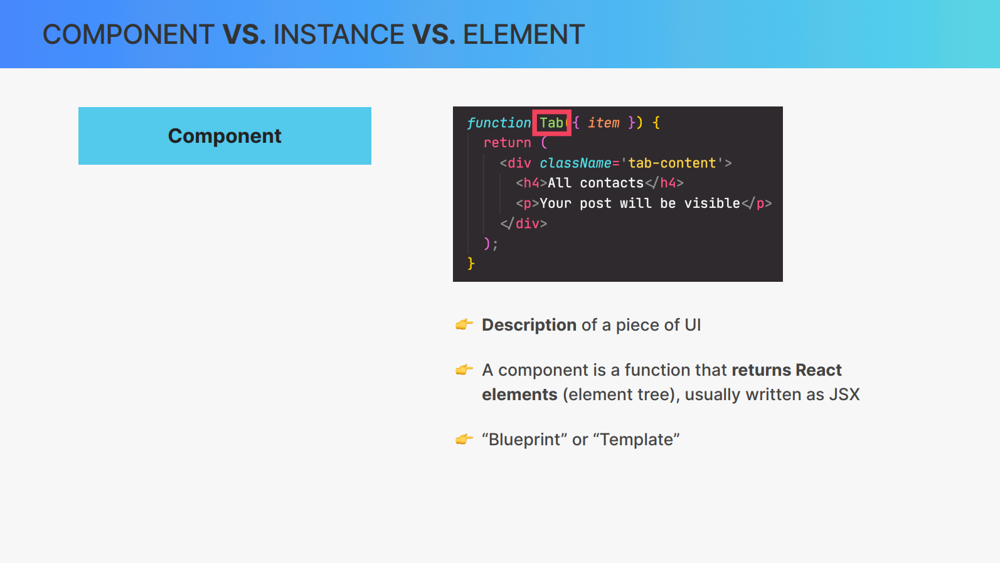

#### 02.2.2 Component vs Instance:
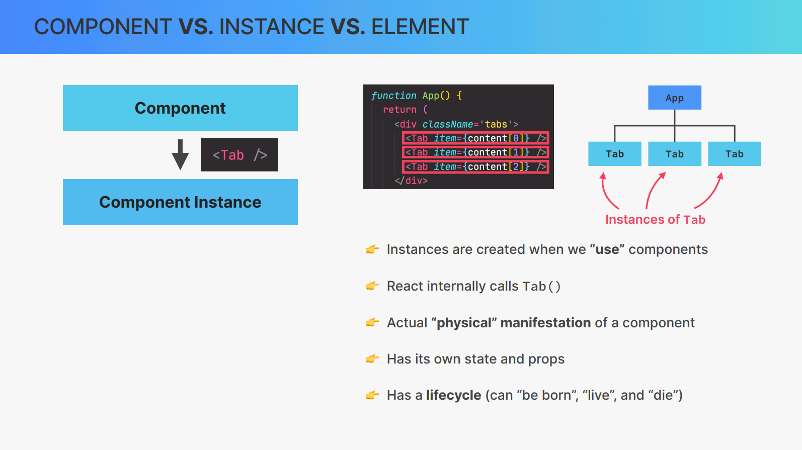

#### 02.2.3 Component vs Instance vs React Element:
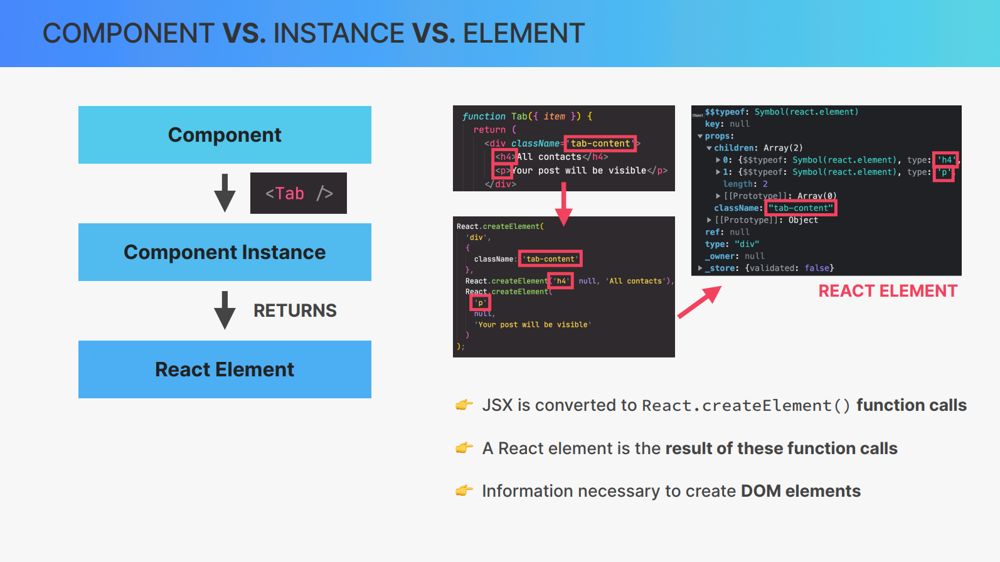

#### 02.2.4 Component vs Instance vs React Element vs DOM Element (HTML):
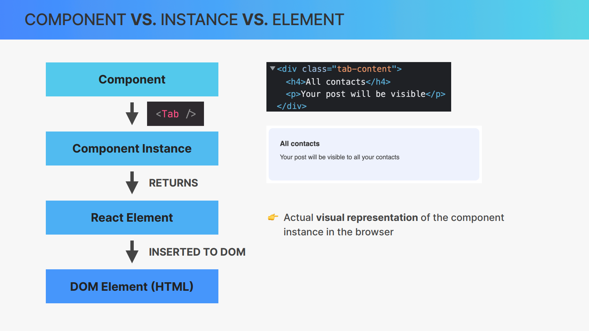

#### 02.2.5 Comparative table:

| Concept | What is it? | Example | Key Features |
|---------|-------------|---------|--------------|
| **Component** | Template or function that defines how a part of the UI should look and behave | `function Button(props) { return <button>{props.text}</button>; }` | - Reusable<br>- Defines structure and behavior<br>- Doesn't physically exist until used |
| **Instance Component** | Concrete use of a Component with specific props | `<Button text="Click here" />` in a specific place | - Has concrete props<br>- Occupies memory<br>- Managed internally by React |
| **React Element** | JavaScript object describing what you want to render | `{type: 'button', props: {children: 'Hello'}, key: null, ref: null}` | - Plain object<br>- Describes what to render, doesn't render it<br>- Immutable |
| **DOM Element** | Real node in the browser (HTML) | `<button style="color: blue;">Hello</button>` in the DOM | - Physically exists on the page<br>- Consumes browser resources<br>- Mutable |

#### 02.2.6 Another comparative table:

| Aspect / Concept      | Component                                                                 | Component Instance                                                                 | React Element                                                                                     | DOM Element                                                                              |
|------------------------|---------------------------------------------------------------------------|------------------------------------------------------------------------------------|---------------------------------------------------------------------------------------------------|------------------------------------------------------------------------------------------|
| **What is it?**        | Function that defines reusable UI logic and structure.                    | **Not applicable** in modern React (functional components don’t create instances).  | JavaScript object describing what to render (immutable).                                          | Real HTML node in the browser.                                                           |
| **Type**               | Function (e.g., `() => JSX`).                                             | N/A                                                                                | Plain JavaScript object (e.g., `{type, props, key, ref}`).                                        | DOM node (e.g., `HTMLButtonElement`).                                                    |
| **Purpose / Role**     | Define UI structure and behavior using props, hooks, and JSX.              | N/A — state and effects are managed via Hooks, not instances.                       | Serve as a lightweight, immutable description for React’s reconciliation process.                 | Represent the actual, visible UI rendered in the browser.                                |
| **How it’s Created**   | Defined by the developer as a function (e.g., `const Button = (props) => <button>{props.text}</button>;`). | N/A — React does **not** instantiate functional components.                        | Created via JSX or `React.createElement()` (e.g., `<Button text="Hi" />` → object).                | Created or updated by React’s renderer (e.g., `react-dom`) in the real DOM.              |
| **Mutability**         | Immutable (function definition never changes).                            | N/A                                                                                | Immutable (new element created on every render if props/state change).                            | Mutable (can be modified directly, though React discourages this).                        |
| **Example**            | `const Button = ({text}) => <button>{text}</button>;`                     | *No instance is created.*                                                          | `{type: Button, props: {text: "Hi"}, key: null, ref: null}`                                      | `<button>Hi</button>` in the browser DOM.                                                |
| **Key Features**       | - Reusable<br>- Uses Hooks for state/effects<br>- Pure functions (ideally) | N/A                                                                                | - Lightweight<br>- Describes "what" to render<br>- Core unit of Virtual DOM                      | - Consumes browser memory/CPU<br>- Visible to user<br>- Final render output               |
| **Use in React**       | Primary building block in modern React (functional + Hooks paradigm).      | Obsolete concept for functional components; React treats them as plain functions.   | Central to React’s rendering model—used for diffing and scheduling updates.                      | Final target of rendering; updated efficiently via React’s reconciliation.               |

### 🐞 02.3 Issues:

| Issue | Status | Log/Error |
| ----- | ------ | --------- |
| **Multiple instances of Tab component without keys** | ⚠️ Identified | `src/components/Tabbed.tsx:17-20` - Four `Tab` component instances are rendered without explicit `key` props. While React can handle this, explicit keys help React identify instances correctly when the list order changes, improving reconciliation performance and preventing potential bugs. |
| **Component instances created conditionally may cause instance confusion** | ⚠️ Identified | `src/components/Tabbed.tsx:22` - The conditional rendering between `<TabContent />` and `<DifferentContent />` switches component types, which causes React to unmount one instance and mount another. This is intentional for demonstration but could be optimized with a single component that handles both cases. |
| **No explicit React Element inspection or debugging utilities** | ℹ️ Low Priority | The project doesn't include examples of inspecting React Elements (e.g., using `console.log` to see the element object structure) or React DevTools setup instructions, which would help developers understand these concepts practically. |
| **Component definitions use function declarations instead of const arrow functions** | ℹ️ Low Priority | `src/components/Tab.tsx:7`, `src/components/Tabbed.tsx:11`, `src/components/TabContent.tsx:7` - Inconsistent use of function declarations vs const arrow functions. While both create components, consistency improves code readability and follows modern React patterns. |
| **Missing React.memo optimization for Tab component** | ⚠️ Identified | `src/components/Tab.tsx:7` - The `Tab` component re-renders even when its props (`num`, `activeTab`, `onClick`) haven't changed. Since multiple `Tab` instances exist, using `React.memo` would prevent unnecessary re-renders of inactive tabs, improving performance. |
| **onClick prop passed directly without memoization** | ⚠️ Identified | `src/components/Tabbed.tsx:17-20` - The `setActiveTab` function is passed directly to each `Tab` instance. While this works, if `Tab` were memoized, a new function reference on each render would cause unnecessary re-renders. Using `useCallback` would optimize this. |
| **No demonstration of React Element structure in code** | ℹ️ Low Priority | The project doesn't include code examples showing what React Elements look like when logged (e.g., `console.log(<Tab num={0} />)`), which would help developers visualize the concept discussed in the lesson. |

### 🧱 02.4 Pending Fixes (TODO)

- [ ] Add explicit `key` props to `Tab` component instances in `Tabbed.tsx` (lines 17-20) - Use `key={num}` to help React identify instances correctly
- [ ] Add `React.memo` to `Tab.tsx` component to prevent unnecessary re-renders when props haven't changed
- [ ] Wrap `setActiveTab` in `useCallback` in `Tabbed.tsx` to maintain stable function reference and optimize memoized `Tab` components
- [ ] Add a code example demonstrating React Element structure - Create a utility function or comment showing what `<Tab num={0} />` compiles to (the React Element object structure)
- [ ] Standardize component definitions - Convert all function declarations to const arrow functions for consistency (`Tab.tsx`, `Tabbed.tsx`, `TabContent.tsx`)
- [ ] Add React DevTools setup instructions in documentation - Include steps for installing and using React DevTools to inspect component instances and React Elements
- [ ] Create a demonstration component that logs React Elements - Add a `DebugElement.tsx` component that shows the structure of React Elements when rendered
- [ ] Document the instance lifecycle - Add comments explaining when React creates/destroys component instances in `Tabbed.tsx` when switching between `TabContent` and `DifferentContent`


<br>


<br>


## 🔧 03. Lesson 125 — _Instances and Elements in Practice_

### 🧠 03.1 Context:

**Instances and Elements in Practice** is a practical lesson that demonstrates the critical difference between using JSX syntax to create React Elements versus calling component functions directly. This lesson is essential because it reveals how React's internal mechanisms work and why certain patterns break React's state management and reconciliation.

#### Definition and Purpose

This lesson explores three different ways to invoke React components:

1. **Using JSX (Recommended)**: `<Component prop={value} />` - Creates a React Element that React can properly manage
2. **Direct Function Call (Outside JSX)**: `Component({ prop: value })` - Executes the function directly, returning raw JSX/React Element without React's management
3. **Direct Function Call (Inside JSX)**: `{Component({ prop: value })}` - Executes the function inside JSX, bypassing React's instance management

#### When These Patterns Occur

- **JSX Usage**: The standard and recommended way - used throughout the project (e.g., `<Tab num={0} />` in `Tabbed.tsx`)
- **Direct Function Call Outside JSX**: Sometimes used for debugging or understanding React internals (e.g., `console.log(DifferentContent())`)
- **Direct Function Call Inside JSX**: Occasionally used by mistake or for specific edge cases, but breaks React's state management

#### Examples from the Project

**Proper JSX Usage** (`src/components/Tabbed.tsx`):
```17:20:src/components/Tabbed.tsx
<Tab num={0} activeTab={activeTab} onClick={setActiveTab} />
<Tab num={1} activeTab={activeTab} onClick={setActiveTab} />
<Tab num={2} activeTab={activeTab} onClick={setActiveTab} />
<Tab num={3} activeTab={activeTab} onClick={setActiveTab} />
```
This creates React Elements that React can properly track, manage state for, and reconcile efficiently.

**React Element Structure** (from lesson 03.2.1):
When using JSX like `<DifferentContent test={123} />`, React creates a React Element object with:
- `type`: The component function
- `props`: The props object (`{ test: 123 }`)
- `$$typeof`: A Symbol for security (prevents XSS attacks)
- `key` and `ref`: For React's reconciliation

**Direct Function Call** (from lesson 03.2.2):
Calling `DifferentContent()` directly executes the function and returns the JSX, but:
- React doesn't create a proper instance
- State management (hooks) won't work correctly
- React can't track or reconcile the component properly
- The `$$typeof` property may be missing or incorrect

**Direct Function Call Inside JSX** (from lesson 03.2.3):
Using `{TabContent({ item: content.at(0) })}` inside JSX:
- Executes the function immediately
- Returns JSX that React renders, but without proper instance management
- State hooks (`useState`, `useEffect`) won't work as expected
- React can't properly track component lifecycle
- Each render creates a new "instance" without React's reconciliation benefits

#### Key Differences and Implications

**JSX vs Direct Function Call**:

| Aspect | JSX (`<Component />`) | Direct Call (`Component()`) |
|--------|----------------------|----------------------------|
| **React Element Creation** | ✅ Creates proper React Element with `$$typeof` | ⚠️ Returns JSX/Element but may lack React metadata |
| **State Management** | ✅ Hooks work correctly | ❌ Hooks don't work (no React instance) |
| **Reconciliation** | ✅ React can efficiently diff and update | ❌ React can't track changes properly |
| **Lifecycle Management** | ✅ Proper mount/unmount/update cycles | ❌ No lifecycle management |
| **Security** | ✅ `$$typeof` Symbol prevents XSS | ⚠️ May lack security features |
| **Performance** | ✅ Optimized by React's reconciliation | ❌ No optimization, re-renders everything |

**Why `$$typeof` Matters**:

The `$$typeof` property is a Symbol that React uses as a security feature. It prevents malicious code from creating fake React Elements that could be used in XSS attacks. When you use JSX, React automatically adds this property. When calling components directly, this property may be missing or incorrect.

**State Management Breakdown**:

When you call a component function directly (especially inside JSX), React doesn't create a proper component instance. This means:
- `useState` hooks create new state on every render (no persistence)
- `useEffect` hooks may run incorrectly or not at all
- Component state is lost between renders
- React can't optimize re-renders

#### Advantages of Using JSX

- **Proper State Management**: Hooks work correctly with React's instance system
- **Security**: `$$typeof` Symbol prevents XSS attacks
- **Performance**: React can efficiently reconcile and update only what changed
- **Lifecycle Management**: Components have proper mount/unmount/update cycles
- **Debugging**: React DevTools can properly track components
- **Type Safety**: TypeScript can better validate JSX props

#### Disadvantages of Direct Function Calls

- **Broken State**: Hooks don't work correctly without React's instance management
- **No Reconciliation**: React can't efficiently update the DOM
- **Security Risk**: Missing `$$typeof` can expose XSS vulnerabilities
- **Performance Issues**: Components re-render completely on every parent render
- **Debugging Difficulties**: React DevTools can't track these components properly
- **Unexpected Behavior**: Component behavior becomes unpredictable

#### When Direct Function Calls Might Be Used

While generally not recommended, direct function calls might be used for:

- **Debugging**: Understanding what React Elements look like (`console.log(Component())`)
- **Testing**: Some testing scenarios might call components directly
- **Utility Functions**: Creating helper functions that return JSX (though these should typically be components)
- **Learning**: Understanding React's internals (as in this lesson)

However, in production code, **always use JSX** for component rendering.

#### Alternatives to Consider

- **Always Use JSX**: For all component rendering in production code
- **Higher-Order Components (HOCs)**: If you need to wrap components, use HOCs that return JSX
- **Render Props**: Use render props pattern instead of calling functions directly
- **Custom Hooks**: Extract logic into hooks rather than calling components as functions
- **Component Composition**: Compose components properly using JSX rather than function calls

#### Connection to Main Theme

This lesson is crucial because it demonstrates:

- **How React Elements Work**: The structure and properties of React Elements created by JSX
- **Why State Persists**: Proper React instances maintain state across renders
- **Why Direct Calls Break State**: Without React's instance management, state is lost
- **Security Features**: How React protects against XSS attacks with `$$typeof`
- **Reconciliation Process**: Why React needs proper Elements to efficiently update the DOM
- **Best Practices**: Why JSX is the standard and recommended approach

Understanding these concepts helps developers:
- Debug state management issues
- Understand why certain patterns don't work
- Appreciate React's internal architecture
- Write more predictable and maintainable code

### ⚙️ 03.2 Updating code according the context:

#### 03.2.1 Using a component instance:
```tsx
/* src/components/Tabbed.tsx */
import { useState } from "react";
import DifferentContent from "./DifferentContent";
import Tab from "./Tab";
import TabContent from "./TabContent";
import type { ContentItem } from "../App";

interface TabbedProps {
  content: ContentItem[];
}
function Tabbed({ content }: TabbedProps) {
  const [activeTab, setActiveTab] = useState(0);
  return (
    <div>
      <div className="tabs">
        <Tab num={0} activeTab={activeTab} onClick={setActiveTab} />
        <Tab num={1} activeTab={activeTab} onClick={setActiveTab} />
        <Tab num={2} activeTab={activeTab} onClick={setActiveTab} />
        <Tab num={3} activeTab={activeTab} onClick={setActiveTab} />
      </div>
      {activeTab <= 2 ? <TabContent item={content.at(activeTab)} /> : <DifferentContent />}
    </div>
  );
}
console.log(<DifferentContent test={123} />);  // 👈🏽 ✅
export default Tabbed;
```
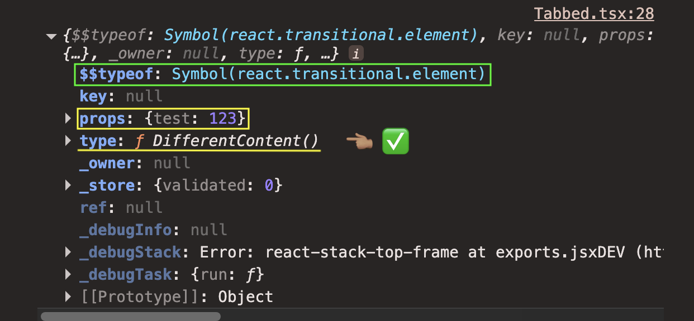

Notes:
- `$$typeof`: security feature implemented by React in order to protect form scripting attacks.
- `Symbols` can not be transmitted via JSON. That's not comming from an API call.

#### 03.2.2 Calling this component directly:
```tsx
/* src/components/Tabbed.tsx */
import { useState } from "react";
import DifferentContent from "./DifferentContent";
import Tab from "./Tab";
import TabContent from "./TabContent";
import type { ContentItem } from "../App";
interface TabbedProps {
  content: ContentItem[];
}
function Tabbed({ content }: TabbedProps) {
  const [activeTab, setActiveTab] = useState(0);
  return (
    <div>
      <div className="tabs">
        <Tab num={0} activeTab={activeTab} onClick={setActiveTab} />
        <Tab num={1} activeTab={activeTab} onClick={setActiveTab} />
        <Tab num={2} activeTab={activeTab} onClick={setActiveTab} />
        <Tab num={3} activeTab={activeTab} onClick={setActiveTab} />
      </div>
      {activeTab <= 2 ? <TabContent item={content.at(activeTab)} /> : <DifferentContent />}
    </div>
  );
}
console.log(DifferentContent());  // 👈🏽 ✅
export default Tabbed;
```
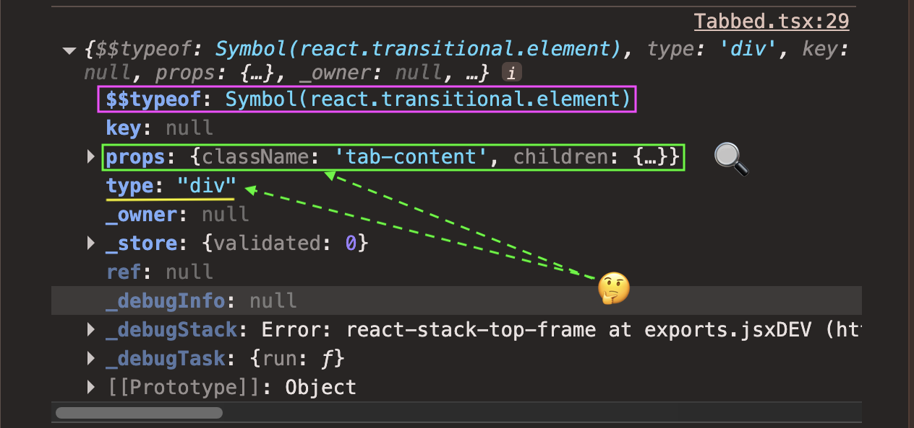

Notes:
- it's showing the raw react element not an instance.

#### 03.2.3 Calling inside a component:
```tsx
/* src/components/Tabbed.tsx */
import { useState } from "react";
import DifferentContent from "./DifferentContent";
import Tab from "./Tab";
import TabContent from "./TabContent";
import type { ContentItem } from "../App";
interface TabbedProps {
  content: ContentItem[];
}
function Tabbed({ content }: TabbedProps) {
  const [activeTab, setActiveTab] = useState(0);
  return (
    <div>
      <div className="tabs">
        <Tab num={0} activeTab={activeTab} onClick={setActiveTab} />
        <Tab num={1} activeTab={activeTab} onClick={setActiveTab} />
        <Tab num={2} activeTab={activeTab} onClick={setActiveTab} />
        <Tab num={3} activeTab={activeTab} onClick={setActiveTab} />
      </div>
      {activeTab <= 2 ? <TabContent item={content.at(activeTab)} /> : <DifferentContent />}

      {TabContent({ item: content.at(0) })}  {/* 👈🏽 ✅ */}

    </div>
  );
}
export default Tabbed;
```
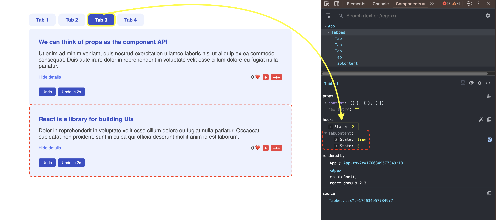
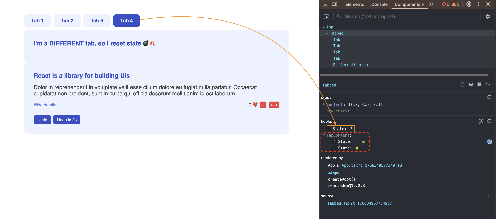


### 🐞 03.3 Issues:

| Issue | Status | Log/Error |
| ----- | ------ | --------- |
| **Debug console.log statements left in code examples** | ⚠️ Identified | `docs/LECTURE_STEPS.md:651,685` - The documentation includes `console.log(<DifferentContent test={123} />)` and `console.log(DifferentContent())` as examples. While these are educational, they should be clearly marked as debug-only code and removed from production examples. These statements would execute on every render if left in actual component code. |
| **Invalid prop passed to DifferentContent component** | ⚠️ Identified | `docs/LECTURE_STEPS.md:651` - The example shows `<DifferentContent test={123} />` but `DifferentContent` component (`src/components/DifferentContent.tsx`) doesn't accept any props. This could cause confusion and TypeScript errors if implemented. The prop is used for demonstration but doesn't match the actual component interface. |
| **Direct function call pattern shown without warnings** | ⚠️ Identified | `docs/LECTURE_STEPS.md:716` - The documentation shows `{TabContent({ item: content.at(0) })}` as a valid pattern, but doesn't emphasize that this breaks React's state management. If `TabContent` uses hooks (which it does - `useState` for `showDetails` and `likes`), calling it directly will cause state to reset on every render, leading to unexpected behavior. |
| **Missing explanation of hook behavior with direct calls** | ⚠️ Identified | The lesson demonstrates direct function calls but doesn't explicitly show how hooks fail when components are called directly. `TabContent` uses `useState` hooks that would break if called directly inside JSX, but this isn't demonstrated or explained in the examples. |
| **No TypeScript error handling for direct calls** | ℹ️ Low Priority | When calling components directly like `TabContent({ item: content.at(0) })`, TypeScript may not catch prop validation errors as effectively as with JSX syntax. The documentation doesn't mention this type safety difference. |
| **Example code uses content.at() which may return undefined** | ⚠️ Identified | `docs/LECTURE_STEPS.md:716` - The example `TabContent({ item: content.at(0) })` uses `content.at(0)` which could return `undefined` if the array is empty. While `TabContent` handles this with an early return, the example doesn't demonstrate proper error handling or validation. |
| **Missing practical demonstration of state loss** | ⚠️ Identified | The lesson explains that direct calls break state management but doesn't include a practical example showing how `TabContent`'s `likes` and `showDetails` state would reset on every render if called directly. A working example would make the concept clearer. |
| **Security implications of missing $$typeof not emphasized** | ℹ️ Low Priority | While the lesson mentions `$$typeof` as a security feature, it doesn't emphasize the XSS attack vector that this prevents. The documentation could better explain why this matters in production applications. |

### 🧱 03.4 Pending Fixes (TODO)

- [ ] Remove or clearly mark debug `console.log` statements in documentation examples (`docs/LECTURE_STEPS.md:651,685`) - Add comments indicating these are for educational purposes only and should not be used in production code
- [ ] Fix invalid prop example in documentation (`docs/LECTURE_STEPS.md:651`) - Either update `DifferentContent` component to accept props or change the example to use a component that actually accepts props (like `TabContent`)
- [ ] Add warning comments in documentation about direct function calls (`docs/LECTURE_STEPS.md:716`) - Emphasize that `{TabContent({ item: content.at(0) })}` breaks React's state management and should never be used in production
- [ ] Create a practical demonstration component showing state loss with direct calls - Add a `BrokenTabContent.tsx` example that calls `TabContent` directly and demonstrates how `likes` and `showDetails` state resets on every render
- [ ] Add explicit explanation of hook behavior with direct calls - Document in the lesson how `useState`, `useEffect`, and other hooks fail when components are called directly instead of using JSX
- [ ] Add TypeScript interface validation example - Show how TypeScript catches prop errors differently with JSX vs direct calls, demonstrating the type safety benefits of JSX
- [ ] Improve error handling in example code (`docs/LECTURE_STEPS.md:588`) - Replace `content.at(0)` with proper validation or use `content[0]` with a null check to demonstrate best practices
- [ ] Add security section explaining XSS prevention - Expand the `$$typeof` explanation to include practical examples of how it prevents XSS attacks and why this matters in production applications
- [ ] Create a comparison component demonstrating both patterns - Add a `ComponentComparison.tsx` that shows side-by-side the difference between JSX usage and direct calls, with visual indicators of state persistence
- [ ] Add React DevTools inspection guide - Include instructions on how to use React DevTools to inspect React Elements created via JSX vs direct calls, showing the structural differences


<br>


## 🔧 04. Lesson 126 — _How Rendenring works - Overview_

### 🧠 04.1 Context:

**How Rendering Works - Overview** is a foundational lesson that explains React's rendering process, from initial mount to subsequent updates. Understanding rendering is crucial because it forms the basis for performance optimization, debugging, and writing efficient React applications.

#### Definition and Purpose

**Rendering** in React is the process of converting React components into actual DOM elements that users can see and interact with. The rendering process involves multiple phases:

1. **Render Phase**: React calls component functions, creates React Elements, and builds a virtual representation of the UI
2. **Commit Phase**: React applies changes to the actual DOM, updating what users see on screen
3. **Re-render**: When state or props change, React re-runs the render phase and commits only the necessary updates

#### The Rendering Cycle

React follows a predictable rendering cycle:

**Initial Render (Mount)**:
- React calls `createRoot()` and renders the root component (`App`)
- Each component function is called, creating React Elements
- React builds a virtual tree of elements
- React commits the tree to the DOM, creating actual HTML elements

**Subsequent Renders (Update)**:
- A trigger causes React to schedule a re-render (state change, prop change, parent re-render)
- React calls component functions again, creating new React Elements
- React compares (diffs) the new tree with the previous one
- React commits only the differences to the DOM

#### How Components are Displayed on Screen

The journey from component code to screen involves several steps:

1. **Component Function Execution**: React calls the component function (e.g., `Tabbed({ content })`)
2. **JSX Compilation**: JSX is compiled into `React.createElement()` calls, creating React Elements
3. **Virtual DOM Creation**: React builds a tree of React Elements (virtual representation)
4. **Reconciliation**: React compares the new virtual tree with the previous one
5. **DOM Updates**: React updates only the changed DOM nodes efficiently

**Example from the Project** (`src/main.tsx`):
```6:10:src/main.tsx
createRoot(document.getElementById('root')!).render(
  <StrictMode>
    <App />
  </StrictMode>,
)
```
This initial render creates the entire component tree: `App` → `Tabbed` → `Tab` (×4) + `TabContent`/`DifferentContent`.

**Component Rendering Flow** (`src/components/Tabbed.tsx`):
```11:25:src/components/Tabbed.tsx
function Tabbed({ content }: TabbedProps) {
  const [activeTab, setActiveTab] = useState(0);

  return (
    <div>
      <div className="tabs">
        <Tab num={0} activeTab={activeTab} onClick={setActiveTab} />
        <Tab num={1} activeTab={activeTab} onClick={setActiveTab} />
        <Tab num={2} activeTab={activeTab} onClick={setActiveTab} />
        <Tab num={3} activeTab={activeTab} onClick={setActiveTab} />
      </div>

      {activeTab <= 2 ? <TabContent item={content.at(activeTab)} /> : <DifferentContent />}
    </div>
  );
}
```
When `Tabbed` renders:
- React calls `Tabbed` function with `content` prop
- Creates React Elements for 4 `Tab` components
- Conditionally creates React Element for `TabContent` or `DifferentContent`
- Commits all elements to the DOM

#### How Renders are Triggered

Renders occur in specific scenarios:

1. **Initial Mount**: When the app first loads (`createRoot().render()`)
2. **State Updates**: When `useState` setter is called (e.g., `setActiveTab(1)`)
3. **Prop Changes**: When a parent component passes new props
4. **Parent Re-render**: When a parent component re-renders, children typically re-render too
5. **Context Updates**: When a Context value changes and components consume it
6. **Force Update**: Using `forceUpdate()` (class components) or `useReducer` dispatch

**State Update Example** (`src/components/Tabbed.tsx`):
```12:12:src/components/Tabbed.tsx
const [activeTab, setActiveTab] = useState(0);
```
When a user clicks a `Tab` button:
- `onClick={() => onClick(num)}` calls `setActiveTab(num)`
- React schedules a re-render of `Tabbed`
- React calls `Tabbed` function again with updated `activeTab` state
- React creates new React Elements for all children
- React reconciles and updates only changed DOM nodes (e.g., active tab class, content display)

**Nested State Update Example** (`src/components/TabContent.tsx`):
```8:9:src/components/TabContent.tsx
const [showDetails, setShowDetails] = useState(true);
const [likes, setLikes] = useState(0);
```
When `setLikes` is called:
- Only `TabContent` component re-renders (not `Tabbed` or `Tab`)
- React calls `TabContent` function again
- Creates new React Elements
- Updates only the DOM node showing the likes count

#### Key Concepts

**Render vs Commit**:
- **Render Phase**: Pure, can be paused/resumed, can throw away work (React 18+ Concurrent Features)
- **Commit Phase**: Synchronous, updates DOM, runs effects, cannot be interrupted

**Re-render Optimization**:
- React only re-renders components whose state/props changed
- Parent re-renders don't always cause child re-renders (if props unchanged)
- React.memo, useMemo, useCallback help prevent unnecessary re-renders

**Batching**:
- React batches multiple state updates into a single re-render
- In React 18+, automatic batching works in all event handlers, promises, timeouts

#### Examples from the Project

**Initial Render Flow**:
1. `main.tsx` calls `createRoot().render(<App />)`
2. `App` renders, returns `<Tabbed content={content} />`
3. `Tabbed` renders with `activeTab = 0`, returns 4 `Tab` elements + `TabContent`
4. Each `Tab` renders with its props
5. `TabContent` renders with `item={content[0]}`
6. React commits entire tree to DOM

**Re-render Flow** (User clicks Tab 2):
1. `Tab` button click calls `setActiveTab(2)`
2. React schedules re-render of `Tabbed`
3. `Tabbed` renders with `activeTab = 2`
4. All 4 `Tab` components re-render (to update active class)
5. `TabContent` re-renders with `item={content[2]}`
6. React reconciles: updates tab classes, updates content text
7. React commits changes to DOM

**State Reset Example** (Switching to Tab 4):
1. User clicks Tab 4, `setActiveTab(3)` is called
2. `Tabbed` re-renders with `activeTab = 3`
3. Conditional renders `<DifferentContent />` instead of `<TabContent />`
4. React unmounts `TabContent` instance (loses `likes` and `showDetails` state)
5. React mounts new `DifferentContent` instance
6. State is reset because it's a different component type

#### Advantages

- **Efficient Updates**: React only updates changed DOM nodes, not entire page
- **Predictable**: Renders are triggered by explicit state/prop changes
- **Automatic**: React handles scheduling and batching automatically
- **Optimizable**: Can use memoization to prevent unnecessary re-renders
- **Debuggable**: React DevTools shows render timing and causes

#### Disadvantages

- **Learning Curve**: Understanding when and why renders occur can be complex
- **Performance Pitfalls**: Unnecessary re-renders can hurt performance if not optimized
- **State Loss**: Switching component types resets state (can be unexpected)
- **Debugging Complexity**: Tracing render causes in large apps can be difficult
- **Over-rendering**: Easy to accidentally cause cascading re-renders

#### When to Consider Alternatives

- **Direct DOM Manipulation**: Only for third-party libraries that require it
- **Web Components**: For framework-agnostic components (though React can wrap them)
- **Server-Side Rendering**: Next.js, Remix for initial render on server
- **Static Site Generation**: For content that doesn't change (Gatsby, Next.js SSG)

#### Connection to Main Theme

This lesson is essential because it explains:

- **Why State Persists**: Component instances maintain state across re-renders when component type and position remain the same
- **Why State Resets**: When component type changes (`TabContent` → `DifferentContent`), React creates a new instance
- **Performance Implications**: Understanding renders helps optimize with React.memo, useMemo, useCallback
- **Debugging**: Knowing render triggers helps identify why components re-render unexpectedly
- **Best Practices**: Understanding renders guides when to lift state, use Context, or optimize components

### ⚙️ 04.2 Updating section:

#### 04.2.1 Quick **RECAP** before we get started:
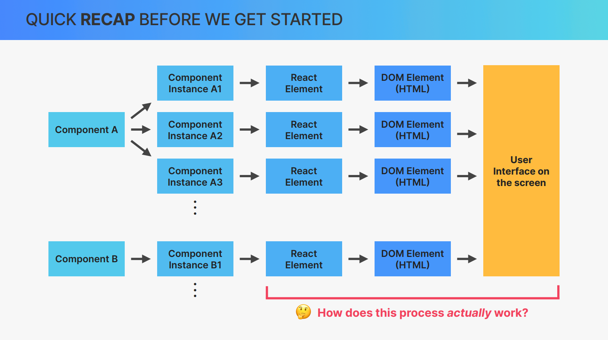

#### 04.2.2 How Components are **DISPLAYED** on the screen:


#### 04.2.3 How renders are **TRIGGERED**
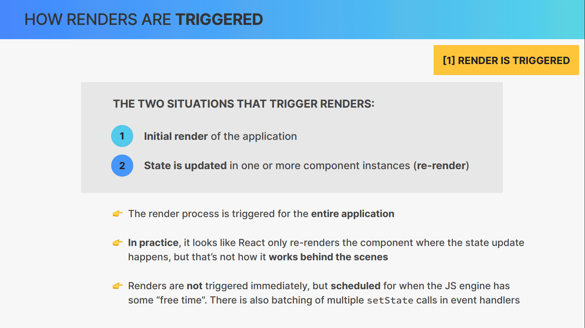

### 🐞 04.3 Issues:

| Issue | Status | Log/Error |
| ----- | ------ | --------- |
| **Unnecessary re-renders of Tab components** | ⚠️ Identified | `src/components/Tabbed.tsx:17-20` - All 4 `Tab` components re-render whenever `activeTab` changes, even though only the active tab's className needs to update. The `onClick` prop (`setActiveTab`) is a new function reference on each render, which could cause issues if `Tab` were memoized. This leads to 4 unnecessary component function calls and React Element creations on every tab change. |
| **TabContent re-renders even when item prop hasn't changed** | ⚠️ Identified | `src/components/Tabbed.tsx:23` - When switching between tabs with the same content (e.g., Tab 0 → Tab 1 → Tab 0), `TabContent` re-renders even though the `item` prop is the same object reference. Without `React.memo`, React can't detect that props haven't changed and re-renders unnecessarily. |
| **Potential render loop with content.at()** | ⚠️ Identified | `src/components/Tabbed.tsx:23` - Using `content.at(activeTab)` creates a new reference check on every render. If `content` array is recreated on parent re-render, `TabContent` will re-render even if the actual item data hasn't changed. This could cause cascading re-renders in larger applications. |
| **Missing render optimization for Tab component** | ⚠️ Identified | `src/components/Tab.tsx:7` - The `Tab` component doesn't use `React.memo`, so it re-renders on every parent render even when its props (`num`, `activeTab`, `onClick`) haven't changed. Since there are 4 `Tab` instances, this causes 4 unnecessary function calls and React Element creations. |
| **Inline function creation in Tab onClick** | ⚠️ Identified | `src/components/Tab.tsx:9` - The `onClick={() => onClick(num)}` creates a new function on every render. While this works, it prevents React from optimizing re-renders and could cause issues if `Tab` were memoized. A stable function reference would be better. |
| **TabContent state resets on every re-render trigger** | ℹ️ Low Priority | `src/components/TabContent.tsx:8-9` - When `Tabbed` re-renders (e.g., from a parent update), `TabContent` re-renders but maintains its state. However, if the component unmounts and remounts (e.g., switching to `DifferentContent` and back), state is lost. This is expected behavior but could be confusing for users. |
| **No render performance monitoring** | ℹ️ Low Priority | The project doesn't include any render tracking or performance monitoring (e.g., `why-did-you-render`, React DevTools Profiler usage examples). This makes it difficult to identify unnecessary re-renders and optimize performance. |
| **Missing explanation of render batching** | ℹ️ Low Priority | The code examples don't demonstrate React's automatic batching behavior (React 18+). For example, if multiple state updates occurred in quick succession, understanding batching would help developers write more efficient code. |

### 🧱 04.4 Pending Fixes (TODO)

- [ ] Add `React.memo` to `Tab.tsx` component to prevent unnecessary re-renders when props haven't changed (`src/components/Tab.tsx:7`)
- [ ] Wrap `setActiveTab` in `useCallback` in `Tabbed.tsx` to provide stable function reference for memoized `Tab` components (`src/components/Tabbed.tsx:12`)
- [ ] Add `React.memo` to `TabContent.tsx` with custom comparison function to prevent re-renders when `item` prop reference is the same (`src/components/TabContent.tsx:7`)
- [ ] Replace inline arrow function in `Tab.tsx` onClick with a memoized handler using `useCallback` (`src/components/Tab.tsx:9`)
- [ ] Replace `content.at(activeTab)` with `content[activeTab]` and add proper null checking to avoid potential undefined issues and improve performance (`src/components/Tabbed.tsx:23`)
- [ ] Add explicit `key` props to `Tab` components in `Tabbed.tsx` to help React identify instances correctly during reconciliation (`src/components/Tabbed.tsx:17-20`)
- [ ] Create a render performance monitoring utility - Add a custom hook `useRenderCount` that logs component render counts to help identify unnecessary re-renders
- [ ] Add React DevTools Profiler usage documentation - Include examples of how to use React DevTools Profiler to analyze render performance in the project
- [ ] Document render batching behavior - Add comments or examples explaining how React 18+ batches state updates automatically
- [ ] Add render optimization examples - Create a comparison component showing optimized vs non-optimized rendering patterns

<br>


## 🔧 05. Lesson 127 — _How Rendenring works - The Render Phase_

### 🧠 05.1 Context:

**How Rendering Works - The Render Phase** is a deep dive into React's internal rendering mechanism, specifically focusing on the Render Phase where React processes component updates, builds the Virtual DOM, and performs reconciliation. Understanding the Render Phase is crucial because it explains how React efficiently updates the UI without directly manipulating the DOM, and why certain optimization techniques work.

#### Definition and Purpose

The **Render Phase** is the first part of React's rendering cycle where React:

1. **Identifies Components to Re-render**: Determines which component instances triggered a re-render (due to state/prop changes)
2. **Creates React Elements**: Calls component functions and converts JSX into React Element objects
3. **Builds Virtual DOM**: Constructs a tree of React Elements representing the desired UI state
4. **Performs Reconciliation**: Compares the new Virtual DOM with the current Fiber tree to determine what changed
5. **Updates Fiber Tree**: Updates React's internal Fiber tree with the new state and creates a list of DOM updates

**Important Distinction**: The Render Phase does **NOT** update the actual DOM. It's a pure, interruptible phase that can be paused, resumed, or even discarded (in React 18+ Concurrent Features). The actual DOM updates happen in the **Commit Phase**, which is synchronous and cannot be interrupted.

#### When the Render Phase Occurs

The Render Phase is triggered whenever React needs to update the UI:

1. **Initial Mount**: When the app first loads (`createRoot().render()`)
2. **State Updates**: When `useState` setter is called (e.g., `setActiveTab(1)` in `Tabbed.tsx`)
3. **Prop Changes**: When a parent component passes new props to a child
4. **Parent Re-render**: When a parent re-renders, all children enter the Render Phase (even if their props didn't change)
5. **Context Updates**: When a Context value changes and components consume it
6. **Force Re-render**: Using `useReducer` dispatch or other mechanisms

**Example from the Project** (`src/components/Tabbed.tsx`):
```11:24:src/components/Tabbed.tsx
function Tabbed({ content }: TabbedProps) {
  const [activeTab, setActiveTab] = useState(0);

  return (
    <div>
      <div className="tabs">
        <Tab num={0} activeTab={activeTab} onClick={setActiveTab} />
        <Tab num={1} activeTab={activeTab} onClick={setActiveTab} />
        <Tab num={2} activeTab={activeTab} onClick={setActiveTab} />
        <Tab num={3} activeTab={activeTab} onClick={setActiveTab} />
      </div>

      {activeTab <= 2 ? <TabContent item={content.at(activeTab)} /> : <DifferentContent />}
    </div>
  );
}
```

When a user clicks a tab button:
- `setActiveTab(num)` is called, triggering a re-render
- **Render Phase begins**: React calls `Tabbed` function again
- React creates new React Elements for all 4 `Tab` components and `TabContent`/`DifferentContent`
- React builds a new Virtual DOM tree
- React reconciles with the current Fiber tree
- React identifies which DOM nodes need updates (active tab class, content display)
- **Commit Phase**: React applies the changes to the actual DOM

#### Virtual DOM (React Element Tree)

The **Virtual DOM** is React's in-memory representation of the component tree. It's a tree of React Elements (plain JavaScript objects) that describe what the UI should look like.

**Key Characteristics**:
- **Cheap to Create**: React Elements are lightweight JavaScript objects, much cheaper than creating actual DOM nodes
- **Fast Comparison**: React can quickly compare two Virtual DOM trees to find differences
- **Not Shadow DOM**: The Virtual DOM has nothing to do with the browser's Shadow DOM API
- **Recreated on Every Render**: Each render creates a new Virtual DOM tree (though React optimizes this)

**Example Virtual DOM Structure**:
When `Tabbed` renders, React creates a Virtual DOM tree like:
```
<div>
  <div className="tabs">
    <Tab num={0} ... />  → React Element {type: Tab, props: {num: 0, ...}}
    <Tab num={1} ... />  → React Element {type: Tab, props: {num: 1, ...}}
    <Tab num={2} ... />  → React Element {type: Tab, props: {num: 2, ...}}
    <Tab num={3} ... />  → React Element {type: Tab, props: {num: 3, ...}}
  </div>
  <TabContent item={...} />  → React Element {type: TabContent, props: {item: ...}}
</div>
```

**Critical Behavior**: When a component renders, **all of its child components are rendered as well**, regardless of whether their props changed. This is why `React.memo` and other optimization techniques are important.

**Example from the Project** (`src/components/Tabbed.tsx`):
```17:20:src/components/Tabbed.tsx
<Tab num={0} activeTab={activeTab} onClick={setActiveTab} />
<Tab num={1} activeTab={activeTab} onClick={setActiveTab} />
<Tab num={2} activeTab={activeTab} onClick={setActiveTab} />
<Tab num={3} activeTab={activeTab} onClick={setActiveTab} />
```

When `Tabbed` re-renders (e.g., `activeTab` changes from 0 to 1):
- All 4 `Tab` components enter the Render Phase and create new React Elements
- Even though only Tab 1's `activeTab === num` condition changed, all tabs are re-rendered
- React reconciles and determines that only the className of Tab 0 and Tab 1 need DOM updates
- Without `React.memo`, all `Tab` components execute their render function on every parent re-render

#### Reconciliation and Diffing

**Reconciliation** is React's process of comparing the new Virtual DOM with the current Fiber tree to determine which DOM elements need to be inserted, deleted, or updated.

**Why Reconciliation is Necessary**:
- **DOM Operations are Slow**: Writing to the DOM is relatively slow compared to JavaScript operations
- **Minimal Updates**: Usually only a small part of the DOM needs to be updated
- **Efficiency**: Reconciliation allows React to batch DOM updates and minimize browser reflows/repaints

**How Reconciliation Works**:
1. React compares the new Virtual DOM tree with the current Fiber tree
2. For each node, React checks if the component type, props, or key changed
3. React determines the minimal set of DOM operations needed
4. React creates a list of DOM updates (insertions, deletions, updates)
5. In the Commit Phase, React applies these updates to the actual DOM

**Example Reconciliation Scenario** (`src/components/Tabbed.tsx`):
When switching from Tab 0 to Tab 1:
- **New Virtual DOM**: Tab 0 has `className="tab"`, Tab 1 has `className="tab active"`
- **Current Fiber Tree**: Tab 0 has `className="tab active"`, Tab 1 has `className="tab"`
- **Reconciliation Result**: 
  - Update Tab 0's className from "tab active" to "tab"
  - Update Tab 1's className from "tab" to "tab active"
  - Update content area (if `TabContent` item prop changed)
- **DOM Updates**: Only these specific className changes are applied

#### Fiber Tree

The **Fiber Tree** is React's internal data structure that represents the component tree. Each node in the Fiber tree is a **Fiber**, which is a unit of work containing:

- **Current State**: The component's current state values
- **Props**: The component's current props
- **Side Effects**: Effects that need to run (useEffect, etc.)
- **Hooks**: Linked list of hooks used by the component
- **Queue of Work**: Pending updates and state changes
- **Child/Sibling/Parent Pointers**: Links to other Fibers in the tree

**Key Characteristics**:
- **Persistent**: Fibers are NOT recreated on every render; they're updated in place
- **Asynchronous Work**: The Fiber architecture allows React to pause, resume, and prioritize work (React 18+ Concurrent Features)
- **Efficient Updates**: React can update specific Fibers without recreating the entire tree

**Fiber vs Virtual DOM**:
- **Virtual DOM**: Created fresh on every render, represents desired state
- **Fiber Tree**: Persistent structure, represents current state and manages component lifecycle
- **Reconciliation**: Compares Virtual DOM (new) with Fiber Tree (current) to find differences

**Example from the Project**:
When `TabContent` renders with `likes` state:
```7:9:src/components/TabContent.tsx
function TabContent({ item }: TabContentProps) {
  const [showDetails, setShowDetails] = useState(true);
  const [likes, setLikes] = useState(0);
```

The Fiber for `TabContent` contains:
- State: `{showDetails: true, likes: 0}`
- Props: `{item: ContentItem}`
- Hooks: Linked list with two `useState` hooks
- Effects: None (no useEffect)
- Work Queue: Empty (unless there's a pending state update)

When `setLikes(1)` is called:
- React schedules an update to the `TabContent` Fiber
- The Render Phase processes this Fiber
- Creates new Virtual DOM with updated `likes` value
- Reconciliation determines only the likes counter DOM node needs updating
- Commit Phase updates that specific DOM node

#### Advantages

- **Performance**: Virtual DOM allows React to batch updates and minimize DOM operations
- **Efficiency**: Reconciliation ensures only changed DOM nodes are updated
- **Predictability**: Understanding the Render Phase helps debug rendering issues
- **Optimization Opportunities**: Knowledge of the Render Phase guides when to use `React.memo`, `useMemo`, `useCallback`
- **Concurrent Features**: The Fiber architecture enables React 18+ concurrent rendering (suspense, transitions)
- **Developer Experience**: Clear separation between Render Phase (pure) and Commit Phase (side effects)

#### Disadvantages

- **Complexity**: The abstraction adds complexity; developers need to understand multiple concepts
- **Learning Curve**: Understanding Virtual DOM, Fiber, and Reconciliation requires significant study
- **Over-rendering**: Components re-render even when props haven't changed (requires optimization)
- **Memory Overhead**: Maintaining both Virtual DOM and Fiber tree consumes memory
- **Debugging Difficulty**: Inspecting Virtual DOM and Fiber tree requires React DevTools
- **Performance Pitfalls**: Without optimization, cascading re-renders can hurt performance

#### When to Consider Alternatives

- **Direct DOM Manipulation**: Only for third-party libraries that require direct DOM access (e.g., D3.js, Chart.js)
- **Web Components**: For framework-agnostic components, though React can wrap Web Components
- **Server-Side Rendering**: Next.js, Remix for initial render on server (still uses React's Render Phase)
- **Static Site Generation**: For content that doesn't change (Gatsby, Next.js SSG)
- **Alternative Frameworks**: Vue.js, Svelte use different approaches (though similar concepts apply)

#### Connection to Main Theme

This lesson is fundamental because it explains:

- **Why Components Re-render**: Understanding that parent re-renders cause all children to enter the Render Phase
- **Why Optimization Matters**: Without `React.memo`, components re-render unnecessarily, creating new React Elements and Virtual DOM nodes
- **How State Persists**: Fiber tree maintains component state and hooks between renders
- **How React Optimizes**: Reconciliation minimizes DOM updates by comparing Virtual DOM with Fiber tree
- **Performance Implications**: Understanding the Render Phase helps identify unnecessary re-renders and optimize with memoization
- **Debugging**: Knowing how the Render Phase works helps debug why components re-render and when state resets

**Practical Example from the Project**:
When `TabContent`'s `likes` state updates:
1. **Render Phase**: `TabContent` function is called, creates new React Element with updated `likes` value
2. **Virtual DOM**: New tree includes `<span>{likes} ❤️</span>` with new value
3. **Reconciliation**: React compares new Virtual DOM with Fiber tree, finds only the likes counter changed
4. **Fiber Update**: Updates the `TabContent` Fiber's state
5. **Commit Phase**: Updates only the `<span>` DOM node's text content
6. **Result**: Only the likes counter updates, not the entire component or parent components

### ⚙️ 05.2 Updating code according the context:

#### 05.2.1 Review: The mechanics of State in React:
- ❌ Rendering is updating the screen/DOM.
- ❌ React completely discards old view (DOM) on re-render.

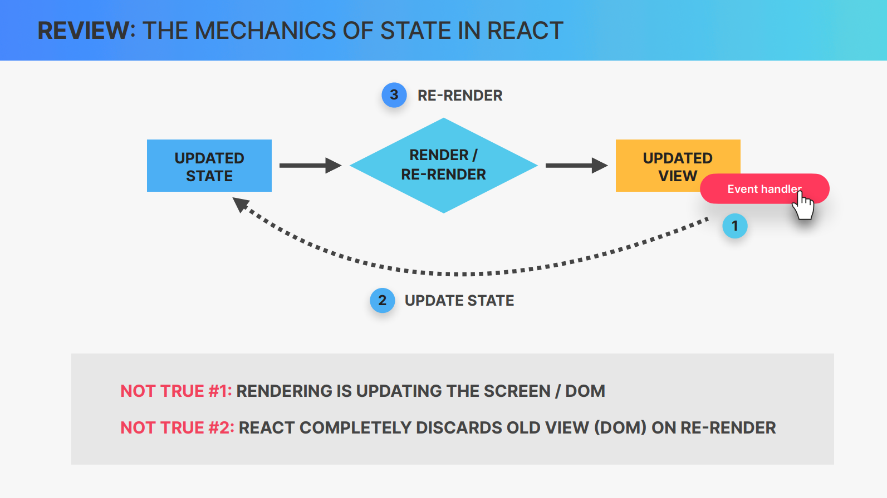

#### 05.2.2 The Render Phase:
- Component instances that triggered re-render.
- React elements.
- New Virtual DOM.

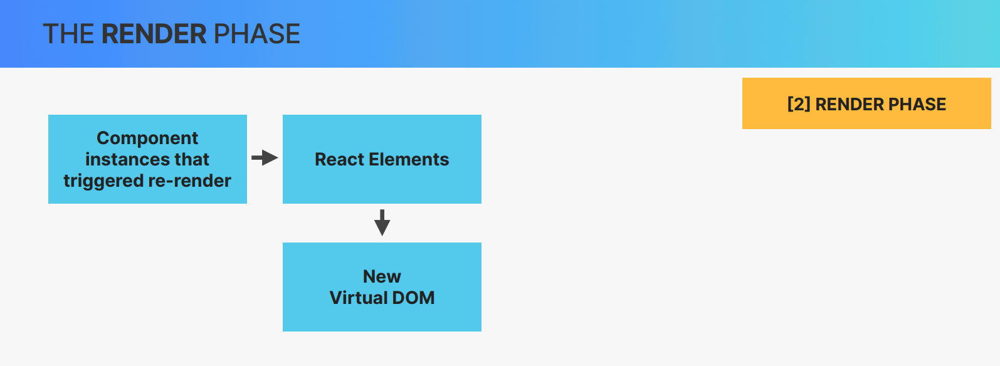

#### 05.2.3 Virtual DOM - React Element Tree:
- Virtual DOM: tree of all React elements created from all instances in the component tree.
- Cheap & fast to create multiple trees. 
- Nothing to do with "Shadow DOM".

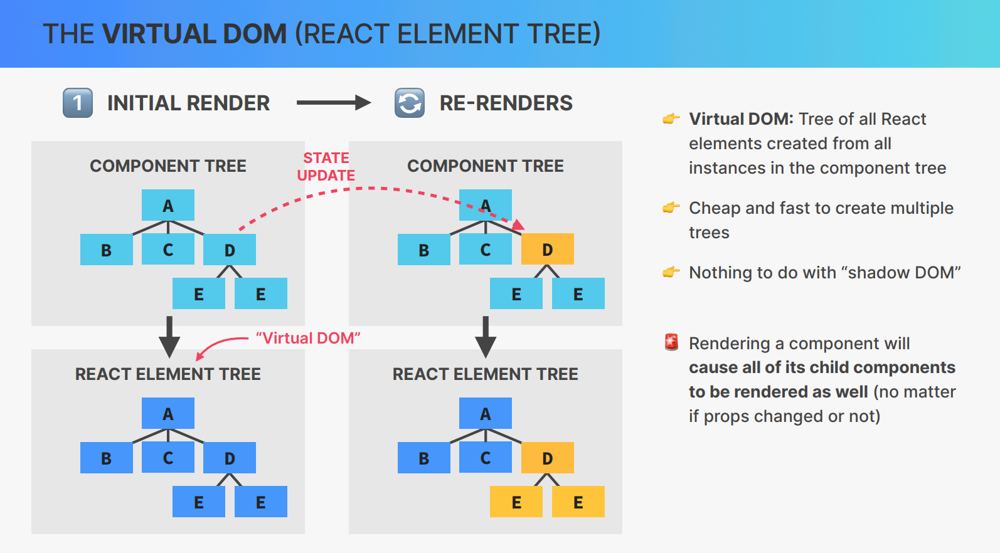

#### 05.2.4 The Virtual DOM - React Element Tree:
- 🚨 Rendering a component will *cause all of its child components to be rendered as well* (no matter if props changed or not).

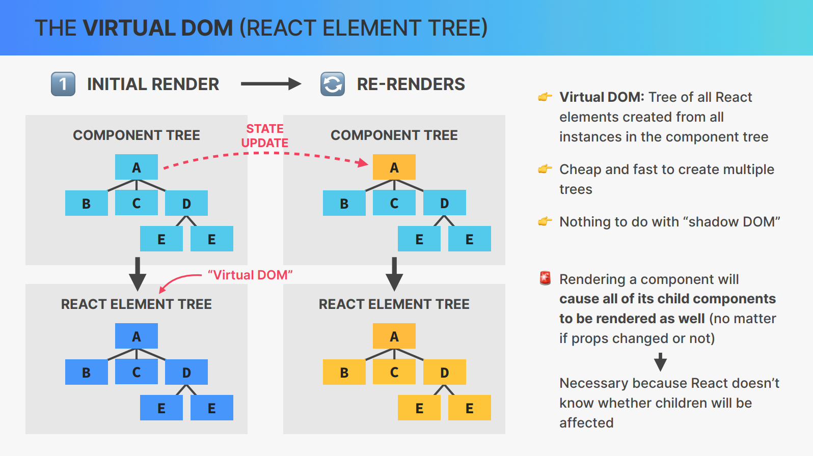

#### 05.2.5 Render Phase:
- Component isntances that triggered re-render.
- React elements.
- New Virtual DOM.
- Current Fiber tree (before state update).
- Reconciliation + Driffing.
- Updated fiber tree.

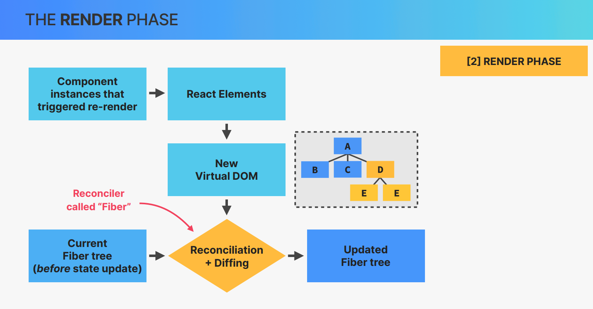

#### 05.2.6 What is **Reconciliation** and why do we need it?
- Writing to the DOM is (relatively) **slow**.
- Usually only a **small part of the DOM** needs to be updated.

- ♥️ **Reconciliation**: Deciding which DOM elements actually need to be *inserted, deleted, or updated* in order to reflect the latest state changes.

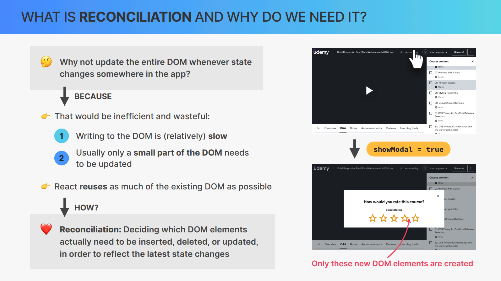

#### 05.2.7 Reconciler: **FIBER**:
- **Fiber tree**: internal tree that has a "fiber" for each component instance and DOM element.
- Fibers are **NOT** re-created on every render.
- Work can be done ***asynchronously***.

- **FIBER**: unit of work which contains:
    - current state
    - Props
    - Side effects
    - Use hooks
    - Queue of  work

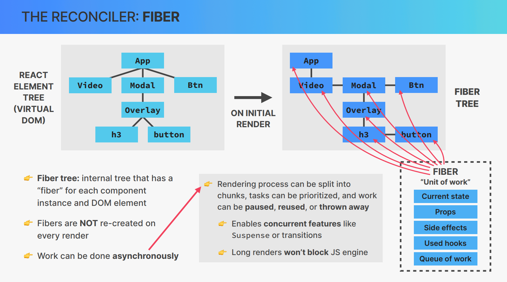

#### 05.2.8 Reconciliation **in action**:
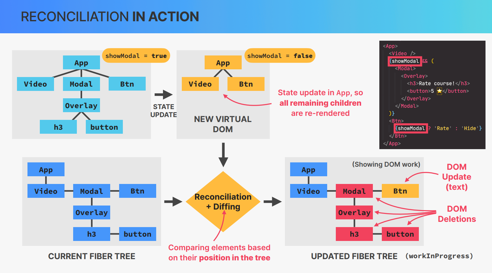

#### 05.2.9 The **Render** phase:
- Component isntances that triggered re-render.
- React elements.
- New Virtual DOM.
- Current Fiber tree (before state update).
- Reconciliation + Driffing.
- Updated fiber tree.
- List of DOM updates

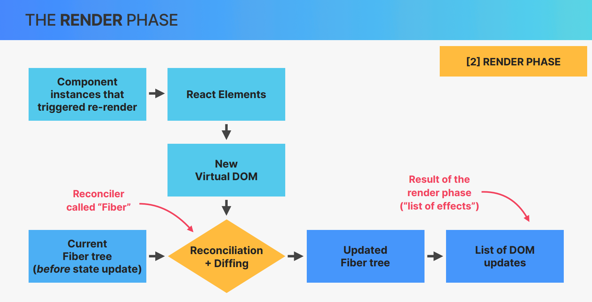


### 🐞 05.3 Issues:

| Issue | Status | Log/Error |
| ----- | ------ | --------- |
| **All child components re-render on parent re-render without optimization** | ⚠️ Identified | `src/components/Tabbed.tsx:17-20` - When `Tabbed` re-renders (e.g., `activeTab` changes), all 4 `Tab` components enter the Render Phase and create new React Elements, even though only the active tab's className needs to change. This causes unnecessary Virtual DOM creation and reconciliation work. Without `React.memo`, React cannot skip rendering these components. |
| **TabContent re-renders unnecessarily when parent re-renders** | ⚠️ Identified | `src/components/Tabbed.tsx:23` - `TabContent` re-renders every time `Tabbed` re-renders, even if the `item` prop hasn't changed. This causes the component function to execute, creating new React Elements and Virtual DOM nodes unnecessarily. The component's internal state (`likes`, `showDetails`) is maintained, but the render function still runs. |
| **No memoization preventing unnecessary Virtual DOM creation** | ⚠️ Identified | `src/components/Tab.tsx:7`, `src/components/TabContent.tsx:7` - Neither `Tab` nor `TabContent` use `React.memo`, so they create new React Elements and Virtual DOM nodes on every parent re-render. This increases reconciliation work and memory usage, even when props haven't changed. |
| **Inline function creation causes new React Element props on every render** | ⚠️ Identified | `src/components/Tab.tsx:9` - The `onClick={() => onClick(num)}` creates a new function reference on every render. This means each `Tab` React Element has different props (new function reference), preventing React from optimizing reconciliation. Even with `React.memo`, this would cause re-renders. |
| **setActiveTab function reference changes on every render** | ⚠️ Identified | `src/components/Tabbed.tsx:12` - The `setActiveTab` function from `useState` is passed directly to all `Tab` components. While the function reference is stable, if `Tab` were memoized, any change in the function reference would cause unnecessary re-renders. Using `useCallback` would ensure a stable reference. |
| **content.at() creates potential reconciliation issues** | ⚠️ Identified | `src/components/Tabbed.tsx:23` - Using `content.at(activeTab)` may return `undefined`, and the reference check in reconciliation might not detect when the same item is accessed differently. Direct array access `content[activeTab]` would be more predictable for React's reconciliation algorithm. |
| **Missing keys on Tab components affects reconciliation** | ⚠️ Identified | `src/components/Tabbed.tsx:17-20` - The `Tab` components don't have explicit `key` props. While React can reconcile them by position, explicit keys (`key={num}`) would help React identify instances correctly during reconciliation, especially if the tab order ever changes dynamically. |
| **No demonstration of Render Phase vs Commit Phase separation** | ℹ️ Low Priority | The project doesn't include examples or comments explaining the separation between Render Phase (pure, can be interrupted) and Commit Phase (synchronous, updates DOM). Adding examples would help developers understand React 18+ concurrent features. |
| **Missing Fiber tree inspection examples** | ℹ️ Low Priority | The project doesn't demonstrate how to inspect the Fiber tree using React DevTools or explain how Fibers persist between renders. Adding documentation or examples would help developers understand the internal structure. |
| **No performance monitoring for Render Phase** | ℹ️ Low Priority | The project doesn't include any tools or examples for monitoring Render Phase performance (e.g., React DevTools Profiler, `why-did-you-render`). This makes it difficult to identify unnecessary re-renders and Virtual DOM creation. |
| **Virtual DOM recreation not optimized** | ⚠️ Identified | Every render creates a completely new Virtual DOM tree, even for components whose props haven't changed. While React optimizes this through reconciliation, the initial Virtual DOM creation still happens for all components. `React.memo` would prevent unnecessary Virtual DOM node creation. |
| **Conditional rendering causes Fiber tree restructuring** | ⚠️ Identified | `src/components/Tabbed.tsx:23` - Switching between `<TabContent />` and `<DifferentContent />` causes React to unmount one Fiber and mount another. This is expected behavior but causes the entire component subtree to be recreated in the Fiber tree, losing state and triggering full reconciliation. |

### 🧱 05.4 Pending Fixes (TODO)

- [ ] Add `React.memo` to `Tab.tsx` component to prevent unnecessary re-renders and Virtual DOM creation when props haven't changed (`src/components/Tab.tsx:7`)
- [ ] Add `React.memo` to `TabContent.tsx` component with custom comparison function to prevent re-renders when `item` prop reference is the same (`src/components/TabContent.tsx:7`)
- [ ] Wrap `setActiveTab` in `useCallback` in `Tabbed.tsx` to provide stable function reference for memoized `Tab` components (`src/components/Tabbed.tsx:12`)
- [ ] Replace inline arrow function in `Tab.tsx` onClick with a memoized handler using `useCallback` to prevent new function references on every render (`src/components/Tab.tsx:9`)
- [ ] Add explicit `key` props to `Tab` components in `Tabbed.tsx` to help React identify instances correctly during reconciliation (`src/components/Tabbed.tsx:17-20`) - Use `key={num}`
- [ ] Replace `content.at(activeTab)` with `content[activeTab]` and add proper null checking to improve reconciliation predictability (`src/components/Tabbed.tsx:23`)
- [ ] Create a custom hook `useRenderCount` that logs component render counts to help identify unnecessary re-renders during the Render Phase
- [ ] Add React DevTools Profiler usage documentation - Include examples of how to use React DevTools Profiler to analyze Render Phase performance and identify unnecessary Virtual DOM creation
- [ ] Add comments explaining Render Phase vs Commit Phase separation - Document in `Tabbed.tsx` and `TabContent.tsx` where Render Phase ends and Commit Phase begins
- [ ] Create a demonstration component showing Virtual DOM structure - Add a `VirtualDOMDemo.tsx` component that logs React Element structures to help visualize Virtual DOM creation
- [ ] Add Fiber tree inspection guide - Include instructions on how to use React DevTools to inspect the Fiber tree and understand how Fibers persist between renders
- [ ] Document reconciliation behavior - Add comments explaining how React reconciles Virtual DOM with Fiber tree in `Tabbed.tsx` when switching tabs
- [ ] Add performance monitoring utility - Create a `RenderPhaseMonitor.tsx` component that tracks and displays render counts, Virtual DOM node creation, and reconciliation metrics
- [ ] Optimize conditional rendering pattern - Consider using a single component with conditional content instead of switching between `TabContent` and `DifferentContent` to avoid Fiber tree restructuring
- [ ] Add examples demonstrating React.memo impact - Create a comparison showing render counts with and without `React.memo` to visualize the optimization benefits

<br>

## 🔧 06. Lesson 128 — _How Rendering Works: The Commit Phase_

### 🧠 06.1 Context:

**How Rendering Works: The Commit Phase** is a crucial lesson that explains the final step of React's rendering cycle, where React applies changes to the actual DOM and executes side effects. Understanding the Commit Phase is essential because it explains when and how users see updates on screen, when side effects run, and why certain operations must be synchronous.

#### Definition and Purpose

The **Commit Phase** is the second and final part of React's rendering cycle where React:

1. **Applies DOM Updates**: Takes the list of DOM changes from the Render Phase and applies them to the actual browser DOM
2. **Executes Side Effects**: Runs `useEffect` hooks, `useLayoutEffect` hooks, and other side effects
3. **Updates Refs**: Updates ref values for DOM elements and component instances
4. **Synchronizes State**: Ensures the Fiber tree matches the committed DOM state
5. **Triggers Browser Paint**: The browser paints the updated DOM to the screen

**Critical Distinction**: Unlike the Render Phase, which is pure, interruptible, and can be discarded, the **Commit Phase is synchronous and cannot be interrupted**. Once the Commit Phase begins, React must complete all DOM updates and side effects before the browser can paint the screen.

#### When the Commit Phase Occurs

The Commit Phase happens immediately after the Render Phase completes:

1. **After Initial Mount**: When `createRoot().render()` completes the Render Phase
2. **After State Updates**: When a state change triggers a re-render and the Render Phase finishes
3. **After Prop Changes**: When parent components pass new props and children complete rendering
4. **After Reconciliation**: Once React has determined what DOM changes are needed

**Important**: The Commit Phase **always** follows the Render Phase. You cannot have a Commit Phase without a Render Phase, but the Render Phase can occur without committing (e.g., if React discards the work in Concurrent Mode).

**Example from the Project** (`src/main.tsx`):
```6:10:src/main.tsx
createRoot(document.getElementById('root')!).render(
  <StrictMode>
    <App />
  </StrictMode>,
)
```

When the app first loads:
- **Render Phase**: React calls `App`, `Tabbed`, `Tab` (×4), and `TabContent` functions, creating React Elements and Virtual DOM
- **Commit Phase**: React creates actual DOM nodes (`<div>`, `<button>`, etc.) and inserts them into `document.getElementById('root')`
- **Browser Paint**: The browser displays the rendered UI to the user

**State Update Example** (`src/components/Tabbed.tsx`):
```11:24:src/components/Tabbed.tsx
function Tabbed({ content }: TabbedProps) {
  const [activeTab, setActiveTab] = useState(0);

  return (
    <div>
      <div className="tabs">
        <Tab num={0} activeTab={activeTab} onClick={setActiveTab} />
        <Tab num={1} activeTab={activeTab} onClick={setActiveTab} />
        <Tab num={2} activeTab={activeTab} onClick={setActiveTab} />
        <Tab num={3} activeTab={activeTab} onClick={setActiveTab} />
      </div>

      {activeTab <= 2 ? <TabContent item={content.at(activeTab)} /> : <DifferentContent />}
    </div>
  );
}
```

When a user clicks Tab 1:
- **Render Phase**: `Tabbed` re-renders, creates new React Elements, reconciles with Fiber tree
- **Commit Phase**: 
  - Updates Tab 0's DOM: removes `active` class from `<button>`
  - Updates Tab 1's DOM: adds `active` class to `<button>`
  - Updates content area: changes text content if `TabContent` item prop changed
- **Browser Paint**: User sees Tab 1 highlighted and new content displayed

#### What Happens During Commit Phase

The Commit Phase consists of three sub-phases:

**1. Before Mutation (Pre-commit)**:
- Runs `getSnapshotBeforeUpdate` (class components)
- Prepares for DOM mutations
- Captures current DOM state if needed

**2. Mutation (Commit)**:
- **DOM Updates**: Applies all DOM insertions, deletions, and updates
- **Ref Updates**: Updates ref values to point to new DOM nodes
- **Cleanup**: Runs cleanup functions from `useEffect` (for dependencies that changed)

**3. Layout (Post-commit)**:
- Runs `useLayoutEffect` hooks synchronously
- Reads layout information (e.g., `getBoundingClientRect()`)
- Triggers browser reflow/repaint
- Runs `componentDidUpdate` (class components)

**Example from the Project** (`src/components/TabContent.tsx`):
```7:9:src/components/TabContent.tsx
function TabContent({ item }: TabContentProps) {
  const [showDetails, setShowDetails] = useState(true);
  const [likes, setLikes] = useState(0);
```

When `setLikes(1)` is called:
- **Render Phase**: `TabContent` re-renders, creates new React Element with `likes: 1`
- **Commit Phase**:
  - **Mutation**: Updates the `<span>{likes} ❤️</span>` DOM node's text content from "0 ❤️" to "1 ❤️"
  - **Layout**: Browser recalculates layout (if needed), triggers repaint
- **After Commit**: Any `useEffect` hooks run (if dependencies changed)

#### ReactDOM and Renderers

React uses different **renderers** to commit changes to different environments:

- **ReactDOM**: Commits to browser DOM (HTML elements)
- **React Native**: Commits to native mobile UI components
- **React Three Fiber**: Commits to WebGL/Three.js 3D scenes
- **React PDF**: Commits to PDF documents

**Example from the Project** (`src/main.tsx`):
```1:2:src/main.tsx
import { StrictMode } from 'react'
import { createRoot } from 'react-dom/client'
```

The `react-dom` package provides the `createRoot` function, which creates a ReactDOM root. When React commits changes, ReactDOM translates React Elements into actual HTML DOM nodes.

**Key Point**: The Render Phase is renderer-agnostic (works the same for all renderers), but the Commit Phase is renderer-specific (ReactDOM commits to DOM, React Native commits to native components).

#### Browser Paint and Visual Updates

After the Commit Phase completes, the browser performs:

1. **Reflow**: Recalculates element positions and sizes
2. **Repaint**: Redraws affected areas of the screen
3. **Composite**: Combines layers for final display

**Performance Consideration**: The Commit Phase is synchronous, so long-running operations during commit can block the browser's main thread, causing janky animations or unresponsive UI.

**Example**: If `TabContent` had a `useLayoutEffect` that performs expensive calculations:
```typescript
useLayoutEffect(() => {
  // This runs synchronously during Commit Phase
  // Long operations here block browser paint
  const rect = elementRef.current?.getBoundingClientRect();
  // ... expensive calculations
}, [dependencies]);
```

This would delay the browser paint until the effect completes.

#### Key Differences: Render Phase vs Commit Phase

| Aspect | Render Phase | Commit Phase |
|--------|--------------|--------------|
| **Purpose** | Create Virtual DOM, reconcile changes | Apply changes to real DOM |
| **Interruptible** | ✅ Yes (React 18+ Concurrent Features) | ❌ No (synchronous) |
| **Can be Discarded** | ✅ Yes (if higher priority work arrives) | ❌ No (must complete) |
| **DOM Updates** | ❌ No DOM changes | ✅ Updates actual DOM |
| **Side Effects** | ❌ No effects run | ✅ `useEffect`, `useLayoutEffect` run |
| **Performance** | Fast (JavaScript objects) | Slower (DOM operations) |
| **Browser Paint** | ❌ No visual changes | ✅ Triggers paint |

#### Advantages

- **Predictable Timing**: Side effects run at predictable times (after DOM updates)
- **Synchronous Updates**: DOM updates happen atomically, preventing partial states
- **Performance**: Batching DOM updates minimizes browser reflows/repaints
- **Debugging**: React DevTools can track commit timing and side effects
- **User Experience**: Changes appear together, preventing visual glitches

#### Disadvantages

- **Blocking**: Long commit phases can block the browser's main thread
- **Synchronous**: Cannot be interrupted, even for high-priority updates
- **Performance Impact**: DOM operations are slower than JavaScript operations
- **Browser Reflow**: Can trigger expensive browser reflows/repaints
- **Complexity**: Understanding when effects run can be confusing

#### When to Consider Alternatives

- **useLayoutEffect vs useEffect**: Use `useLayoutEffect` for DOM measurements that must happen before paint, `useEffect` for async side effects
- **Direct DOM Manipulation**: Only for third-party libraries that require it (e.g., D3.js, Chart.js)
- **Web Workers**: For expensive calculations that shouldn't block the Commit Phase
- **RequestAnimationFrame**: For animations that need to sync with browser paint
- **Deferred Values**: React 18+ `useDeferredValue` for non-urgent updates

#### Connection to Main Theme

This lesson is essential because it explains:

- **When Users See Changes**: The Commit Phase is when visual updates appear on screen
- **When Side Effects Run**: `useEffect` and `useLayoutEffect` execute during Commit Phase
- **Why State Persists**: After commit, the Fiber tree matches the DOM, maintaining state consistency
- **Performance Implications**: Understanding commit helps optimize with `useMemo`, `useCallback`, and `React.memo` to reduce commit work
- **Debugging**: Knowing commit timing helps debug when effects run and why UI updates appear when they do
- **Best Practices**: Understanding commit guides when to use `useLayoutEffect` vs `useEffect` and how to avoid blocking commits

**Practical Example from the Project**:
When switching from Tab 0 to Tab 1:
1. **Render Phase**: `Tabbed` re-renders, creates new Virtual DOM, reconciles
2. **Commit Phase**:
   - Updates Tab 0 button: `className` changes from "tab active" to "tab"
   - Updates Tab 1 button: `className` changes from "tab" to "tab active"
   - Updates content area: `TabContent` receives new `item` prop
3. **Browser Paint**: User sees Tab 1 highlighted and new content
4. **After Commit**: If `TabContent` had `useEffect` hooks, they would run now

### ⚙️ 06.2 Updating code according the context:

#### 06.2.1 **Commit** phase and browser **paint**

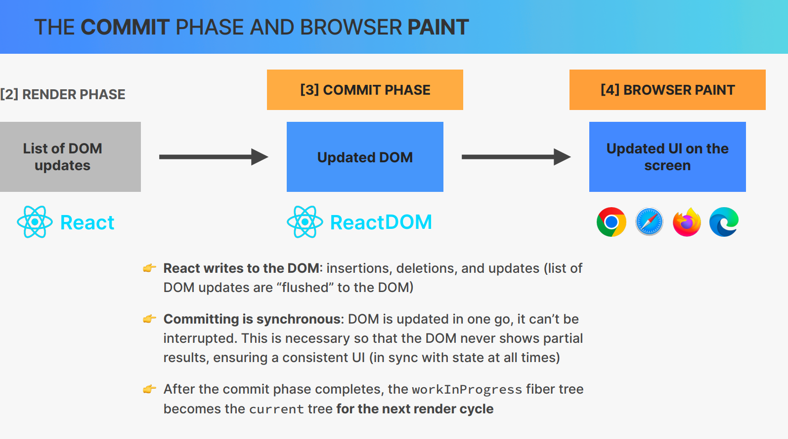

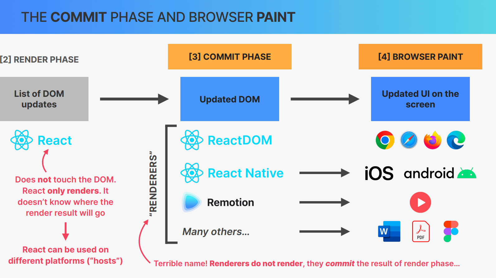

#### 06.2.2 **RECAP**: Putting it all together:
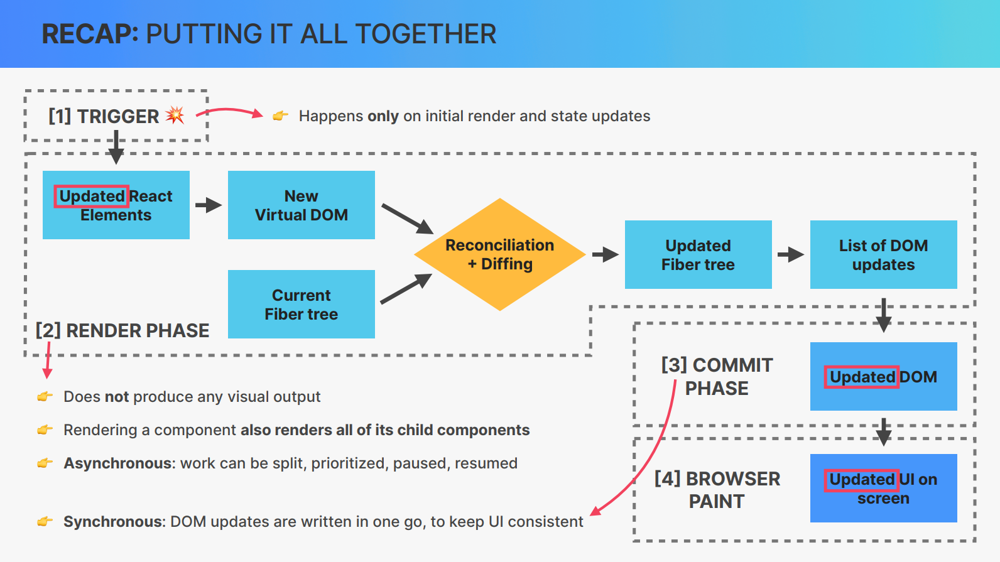

### 🐞 06.3 Issues:

| Issue | Status | Log/Error |
| ----- | ------ | --------- |
| **No useEffect hooks demonstrating Commit Phase timing** | ⚠️ Identified | `src/components/TabContent.tsx:7` - The component doesn't use `useEffect` or `useLayoutEffect` hooks, so there's no demonstration of when side effects run during the Commit Phase. Adding examples would help developers understand the difference between Render Phase and Commit Phase execution timing. |
| **Missing useLayoutEffect examples for synchronous DOM access** | ⚠️ Identified | The project doesn't include examples of `useLayoutEffect` for DOM measurements that must happen before browser paint. This would demonstrate the Layout sub-phase of the Commit Phase and help developers understand when to use `useLayoutEffect` vs `useEffect`. |
| **No demonstration of commit phase blocking behavior** | ⚠️ Low Priority | The project doesn't show how long-running operations during commit can block the browser's main thread. Adding examples or documentation would help developers understand performance implications of the Commit Phase. |
| **Missing cleanup function examples in useEffect** | ⚠️ Identified | `src/components/TabContent.tsx` - If `useEffect` hooks were added, there are no examples showing cleanup functions that run during the Commit Phase's Mutation sub-phase. This is important for understanding when cleanup occurs relative to DOM updates. |
| **No ref updates demonstrated during Commit Phase** | ℹ️ Low Priority | The project doesn't use refs (`useRef`) to demonstrate how ref values are updated during the Commit Phase. Adding ref examples would show how React synchronizes refs with DOM nodes after mutations. |
| **Missing documentation on commit phase sub-phases** | ℹ️ Low Priority | The lesson doesn't explicitly explain the three sub-phases of Commit Phase (Before Mutation, Mutation, Layout) and when each occurs. Adding this detail would provide a more complete understanding of the Commit Phase. |
| **No performance monitoring for commit phase duration** | ℹ️ Low Priority | The project doesn't include tools or examples for measuring Commit Phase performance (e.g., React DevTools Profiler, Performance API). This makes it difficult to identify commit phase bottlenecks. |
| **TabContent state updates trigger commit but no visual feedback** | ⚠️ Identified | `src/components/TabContent.tsx:28` - When `likes` state updates, the Commit Phase updates the DOM, but there's no visual transition or animation to demonstrate the commit happening. Adding CSS transitions would make the commit phase more observable. |
| **Missing examples of batching multiple state updates in single commit** | ℹ️ Low Priority | The project doesn't demonstrate how React batches multiple state updates into a single Commit Phase. For example, if multiple `setLikes` calls happened quickly, they would be batched, but this isn't demonstrated or explained. |
| **No demonstration of commit phase vs render phase separation** | ⚠️ Identified | The code doesn't include comments or examples clearly separating Render Phase work (creating React Elements) from Commit Phase work (updating DOM). Adding explicit examples would help developers understand the distinction. |

### 🧱 06.4 Pending Fixes (TODO)

- [ ] Add `useEffect` hook to `TabContent.tsx` to demonstrate Commit Phase timing - Add an effect that logs when it runs, showing it executes after DOM updates during Commit Phase (`src/components/TabContent.tsx`)
- [ ] Add `useLayoutEffect` example for DOM measurements - Create a demonstration showing `useLayoutEffect` running synchronously during Commit Phase's Layout sub-phase, before browser paint
- [ ] Add cleanup function example in `useEffect` - Demonstrate how cleanup functions run during Commit Phase's Mutation sub-phase when dependencies change (`src/components/TabContent.tsx`)
- [ ] Add `useRef` example demonstrating ref updates during Commit Phase - Show how ref values are synchronized with DOM nodes after mutations
- [ ] Document Commit Phase sub-phases - Add detailed explanation of Before Mutation, Mutation, and Layout sub-phases in the Context section (06.1)
- [ ] Add React DevTools Profiler usage for Commit Phase - Include examples of how to use React DevTools Profiler to measure Commit Phase duration and identify bottlenecks
- [ ] Add CSS transitions to demonstrate Commit Phase visually - Add transitions to `TabContent` likes counter to make DOM updates during Commit Phase more observable (`src/components/TabContent.tsx:28`)
- [ ] Add comments separating Render Phase from Commit Phase - Add explicit comments in `Tabbed.tsx` and `TabContent.tsx` showing where Render Phase ends and Commit Phase begins
- [ ] Create demonstration of state update batching - Add example showing how multiple rapid `setLikes` calls are batched into a single Commit Phase
- [ ] Add performance monitoring utility for Commit Phase - Create a custom hook `useCommitPhaseMonitor` that measures and logs Commit Phase duration using Performance API
- [ ] Add example of blocking commit phase behavior - Create a demonstration component showing how long-running operations during commit can block browser paint
- [ ] Document when to use `useLayoutEffect` vs `useEffect` - Add guidance explaining that `useLayoutEffect` runs synchronously during Commit Phase (before paint) while `useEffect` runs asynchronously (after paint)


<br>

## 🔧 07. Lesson 129 — _How Diffing Works_

### 🧠 07.1 Context:

**How Diffing Works** is a fundamental lesson that explains React's diffing algorithm, which is the core mechanism React uses to efficiently compare the new Virtual DOM with the current Fiber tree during reconciliation. Understanding diffing is crucial because it explains how React decides whether to update, reuse, or replace components and DOM elements, directly impacting performance and state management.

#### Definition and Purpose

**Diffing** (also called "reconciliation diffing") is React's algorithm for comparing two Virtual DOM trees (the new one from the current render and the previous one stored in the Fiber tree) to determine the minimal set of changes needed to update the DOM. The diffing process happens during the Render Phase, before the Commit Phase applies changes to the actual DOM.

**Key Principle**: React uses a **heuristic O(n) algorithm** based on two assumptions:
1. **Two elements of different types** will produce different trees
2. **Stable keys** help React identify which items have changed, been added, or removed

#### When Diffing Occurs

Diffing happens during every render cycle:

1. **Initial Mount**: When the app first loads, React compares the initial Virtual DOM with an empty Fiber tree
2. **State Updates**: When state changes trigger a re-render (e.g., `setActiveTab(1)` in `Tabbed.tsx`)
3. **Prop Changes**: When parent components pass new props to children
4. **Component Re-renders**: Whenever a component function is called and creates new React Elements
5. **Conditional Rendering**: When components are conditionally shown/hidden (e.g., `TabContent` vs `DifferentContent`)

**Example from the Project** (`src/components/Tabbed.tsx`):
```11:24:src/components/Tabbed.tsx
function Tabbed({ content }: TabbedProps) {
  const [activeTab, setActiveTab] = useState(0);

  return (
    <div>
      <div className="tabs">
        <Tab num={0} activeTab={activeTab} onClick={setActiveTab} />
        <Tab num={1} activeTab={activeTab} onClick={setActiveTab} />
        <Tab num={2} activeTab={activeTab} onClick={setActiveTab} />
        <Tab num={3} activeTab={activeTab} onClick={setActiveTab} />
      </div>

      {activeTab <= 2 ? <TabContent item={content.at(activeTab)} /> : <DifferentContent />}
    </div>
  );
}
```

When a user clicks Tab 1 (changing `activeTab` from 0 to 1):
- React creates a new Virtual DOM tree
- **Diffing begins**: React compares the new tree with the current Fiber tree
- For each `Tab` component, React checks: same position, same type (`Tab`), same key (if provided)
- React identifies that only the `activeTab` prop changed, so it updates the className props
- React determines minimal DOM updates: change Tab 0's className, change Tab 1's className

#### How Diffing Works: The Algorithm

React's diffing algorithm follows a **tree-diffing strategy** that compares elements level by level:

**1. Comparing Elements at the Root Level**:

React first compares the root elements of the component tree:

- **Different Element Types**: If the element types are different, React will **unmount the old tree** and **mount a new tree**
  - Example: Switching from `<TabContent />` to `<DifferentContent />` unmounts `TabContent` and mounts `DifferentContent`
  - **State is lost** because React destroys the old component instance

- **Same Element Type**: If the element types are the same, React **updates the existing instance** and only changes the props
  - Example: `<Tab num={0} />` → `<Tab num={0} />` (same type, props may differ)
  - **State is preserved** because React reuses the same component instance

**Example from the Project** (`src/components/Tabbed.tsx`):
```23:23:src/components/Tabbed.tsx
{activeTab <= 2 ? <TabContent item={content.at(activeTab)} /> : <DifferentContent />}
```

When switching from Tab 2 to Tab 3:
- **Before**: `<TabContent item={content[2]} />` (element type: `TabContent`)
- **After**: `<DifferentContent />` (element type: `DifferentContent`)
- **Diffing Result**: Different element types → React unmounts `TabContent` (loses `likes` and `showDetails` state) and mounts `DifferentContent`
- **State Loss**: This is why state resets when switching to Tab 4

**2. Comparing Elements at the Same Position**:

When React encounters elements at the same position in the tree, it compares them based on:

- **Element Type**: Same type → update props, different type → replace
- **Key Prop**: If keys are provided, React uses them to identify which elements correspond to each other
- **Props**: React compares props to determine what changed

**Example: Same Position, Same Element Type** (`src/components/Tabbed.tsx`):
```17:20:src/components/Tabbed.tsx
<Tab num={0} activeTab={activeTab} onClick={setActiveTab} />
<Tab num={1} activeTab={activeTab} onClick={setActiveTab} />
<Tab num={2} activeTab={activeTab} onClick={setActiveTab} />
<Tab num={3} activeTab={activeTab} onClick={setActiveTab} />
```

When `activeTab` changes from 0 to 1:
- **Position 0**: `<Tab num={0} activeTab={1} />` vs `<Tab num={0} activeTab={0} />`
  - Same type (`Tab`), same position → React updates props (`activeTab` changed)
  - React updates the className prop: `"tab active"` → `"tab"`
- **Position 1**: `<Tab num={1} activeTab={1} />` vs `<Tab num={1} activeTab={0} />`
  - Same type (`Tab`), same position → React updates props (`activeTab` changed)
  - React updates the className prop: `"tab"` → `"tab active"`
- **Positions 2 and 3**: Props haven't changed, but React still checks them during diffing

**3. The Role of Keys in Diffing**:

**Keys** are special props that help React identify which items have changed, been added, or removed in lists. Keys should be:
- **Unique**: Each key should be unique among siblings
- **Stable**: Keys should not change between renders for the same item
- **Predictable**: Keys should be based on item identity, not array index (when items can be reordered)

**Without Keys** (Current Implementation):
```17:20:src/components/Tabbed.tsx
<Tab num={0} activeTab={activeTab} onClick={setActiveTab} />
<Tab num={1} activeTab={activeTab} onClick={setActiveTab} />
<Tab num={2} activeTab={activeTab} onClick={setActiveTab} />
<Tab num={3} activeTab={activeTab} onClick={setActiveTab} />
```

React uses **position-based diffing**: React compares elements by their position in the tree. This works fine when the order doesn't change, but can cause issues if tabs are reordered dynamically.

**With Keys** (Recommended):
```tsx
<Tab key={0} num={0} activeTab={activeTab} onClick={setActiveTab} />
<Tab key={1} num={1} activeTab={activeTab} onClick={setActiveTab} />
<Tab key={2} num={2} activeTab={activeTab} onClick={setActiveTab} />
<Tab key={3} num={3} activeTab={activeTab} onClick={setActiveTab} />
```

React uses **key-based diffing**: React matches elements by their key, not position. This allows React to:
- Identify which elements correspond to each other even if order changes
- Reuse component instances more efficiently
- Preserve state when items are reordered

**4. Diffing Behavior: Same Position, Different Element**:

When React encounters different element types at the same position:

**Example from the Project**:
```23:23:src/components/Tabbed.tsx
{activeTab <= 2 ? <TabContent item={content.at(activeTab)} /> : <DifferentContent />}
```

**Scenario**: Switching from Tab 2 (`activeTab = 2`) to Tab 3 (`activeTab = 3`)

**Before** (Virtual DOM):
```tsx
<TabContent item={content[2]} />
```

**After** (Virtual DOM):
```tsx
<DifferentContent />
```

**Diffing Process**:
1. React compares elements at the same position
2. Element types differ: `TabContent` vs `DifferentContent`
3. React **unmounts** `TabContent`:
   - Destroys the component instance
   - Loses state (`likes`, `showDetails`)
   - Runs cleanup (if `useEffect` cleanup exists)
4. React **mounts** `DifferentContent`:
   - Creates a new component instance
   - Initializes with default state
5. React updates the DOM: removes `TabContent` DOM nodes, inserts `DifferentContent` DOM nodes

**Result**: State is lost because React treats this as a completely different component.

**5. Diffing Behavior: Same Position, Same Element**:

When React encounters the same element type at the same position:

**Example from the Project**:
```17:17:src/components/Tabbed.tsx
<Tab num={0} activeTab={activeTab} onClick={setActiveTab} />
```

**Scenario**: `activeTab` changes from 0 to 1

**Before** (Virtual DOM):
```tsx
<Tab num={0} activeTab={0} onClick={setActiveTab} />
```

**After** (Virtual DOM):
```tsx
<Tab num={0} activeTab={1} onClick={setActiveTab} />
```

**Diffing Process**:
1. React compares elements at the same position
2. Element types match: `Tab` === `Tab`
3. React **reuses** the existing component instance:
   - Keeps the same Fiber node
   - Preserves state (if `Tab` had state, it would be preserved)
   - Updates props: `activeTab` changes from 0 to 1
4. React compares props:
   - `num`: 0 === 0 → no change
   - `activeTab`: 0 !== 1 → **changed**
   - `onClick`: same function reference → no change
5. React determines DOM updates:
   - Updates className prop: `"tab active"` → `"tab"`
   - No other DOM changes needed

**Result**: Component instance is reused, state is preserved, only necessary DOM updates occur.

#### Diffing Performance Optimizations

React's diffing algorithm is optimized for common use cases:

**1. Tree-Level Comparison**:
- React compares trees level by level, not deeply nested
- If a parent element type changes, React doesn't diff children (assumes entire subtree changed)
- This is why switching `TabContent` → `DifferentContent` unmounts the entire subtree

**2. Key-Based Matching**:
- Keys help React match elements efficiently
- Without keys, React uses position-based matching (slower, can cause bugs)
- With stable keys, React can identify moved items without recreating them

**3. Prop Comparison**:
- React uses shallow comparison for props
- Object/array references must be the same for React to skip updates
- This is why `useMemo` and `useCallback` are important for optimization

**Example from the Project** (`src/components/Tab.tsx`):
```7:12:src/components/Tab.tsx
function Tab({ num, activeTab, onClick }: TabProps) {
  return (
    <button className={activeTab === num ? "tab active" : "tab"} onClick={() => onClick(num)}>
      Tab {num + 1}
    </button>
  );
}
```

When `Tabbed` re-renders:
- Each `Tab` receives new React Element props
- React compares props during diffing:
  - `num`: Primitive comparison (fast)
  - `activeTab`: Primitive comparison (fast)
  - `onClick`: Reference comparison (new function on each render → always different)
- The `onClick` prop always differs, so React always updates it (even though the function behavior is the same)

#### Examples from the Project

**Example 1: Tab Switching (Same Element Type)**:
When switching from Tab 0 to Tab 1:
1. **Render Phase**: `Tabbed` creates new Virtual DOM with updated `activeTab` prop
2. **Diffing**: React compares each `Tab` element:
   - Tab 0: Same type, same position → update `activeTab` prop → className changes
   - Tab 1: Same type, same position → update `activeTab` prop → className changes
   - Tab 2 & 3: Same type, same position → props unchanged → no updates needed
3. **Commit Phase**: Only Tab 0 and Tab 1's className attributes are updated in the DOM

**Example 2: Content Switching (Different Element Type)**:
When switching from Tab 2 to Tab 3:
1. **Render Phase**: `Tabbed` creates new Virtual DOM with `<DifferentContent />` instead of `<TabContent />`
2. **Diffing**: React compares elements at the same position:
   - Element types differ: `TabContent` !== `DifferentContent`
   - React unmounts `TabContent` (loses state)
   - React mounts `DifferentContent` (new instance)
3. **Commit Phase**: React removes `TabContent` DOM nodes and inserts `DifferentContent` DOM nodes

**Example 3: Content Update (Same Element Type, Different Props)**:
When switching from Tab 0 to Tab 1 (both show `TabContent`):
1. **Render Phase**: `Tabbed` creates new Virtual DOM with `<TabContent item={content[1]} />`
2. **Diffing**: React compares elements:
   - Same type: `TabContent` === `TabContent`
   - Same position: content area
   - Props changed: `item` prop references different `ContentItem`
3. **React reuses** `TabContent` instance:
   - Preserves state (`likes`, `showDetails`)
   - Updates `item` prop
   - Re-renders `TabContent` with new item
4. **Commit Phase**: Updates text content in DOM (summary and details)

#### Advantages

- **Efficient Updates**: Diffing minimizes DOM operations by only updating what changed
- **State Preservation**: Same element types at same positions preserve component state
- **Performance**: O(n) algorithm is fast for typical component trees
- **Predictable**: Understanding diffing helps predict when state is preserved or lost
- **Optimization Opportunities**: Knowledge of diffing guides when to use keys, `React.memo`, and prop memoization

#### Disadvantages

- **State Loss**: Different element types cause state to be lost (can be unexpected)
- **Key Requirements**: Missing or unstable keys can cause bugs and performance issues
- **Shallow Comparison**: Props are compared shallowly, requiring `useMemo`/`useCallback` for deep objects
- **Position-Based Matching**: Without keys, React uses position, which can cause issues when items are reordered
- **Learning Curve**: Understanding when diffing preserves or destroys state requires study
- **Performance Pitfalls**: Inefficient diffing (e.g., new object references on every render) can cause unnecessary updates

#### When to Consider Alternatives

- **Keys in Lists**: Always use stable, unique keys when rendering lists to optimize diffing
- **React.memo**: Use `React.memo` to prevent diffing when props haven't changed
- **useMemo/useCallback**: Memoize props to prevent unnecessary diffing comparisons
- **Component Composition**: Structure components to minimize element type changes (preserve state)
- **State Lifting**: Lift state up when switching between different component types causes unwanted state loss

#### Connection to Main Theme

This lesson is essential because it explains:

- **Why State Persists**: Same element types at same positions preserve component instances and state
- **Why State Resets**: Different element types cause React to unmount old and mount new instances
- **Performance Implications**: Understanding diffing helps optimize with keys, `React.memo`, and prop memoization
- **Reconciliation Process**: Diffing is the core of React's reconciliation algorithm
- **Best Practices**: Understanding diffing guides when to use keys, how to structure components, and when to optimize

**Practical Example from the Project**:
When `TabContent`'s `likes` state updates:
1. **Render Phase**: `TabContent` creates new Virtual DOM with updated `likes` value
2. **Diffing**: React compares new Virtual DOM with Fiber tree:
   - Same element type: `TabContent` === `TabContent`
   - Same position: content area
   - Props unchanged: `item` prop is the same reference
   - Internal state changed: `likes` updated in Fiber
3. **React reuses** `TabContent` instance, updates state in Fiber
4. **Commit Phase**: Updates only the `<span>{likes} ❤️</span>` DOM node's text content
5. **Result**: Only the likes counter updates, component instance and other state are preserved

### ⚙️ 07.2 Updating according the context:

#### 07.2.1 Render phase:

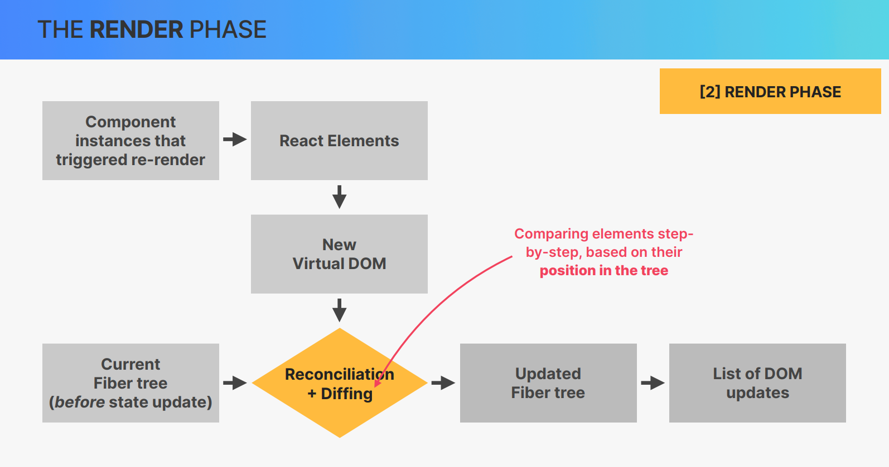

#### 07.2.2 How Diffing works: Same positon -> different element

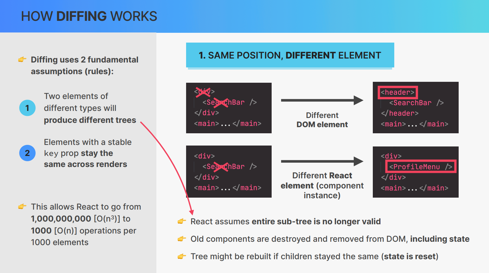

#### 07.2.3 How Diffing works: Same positon -> same element

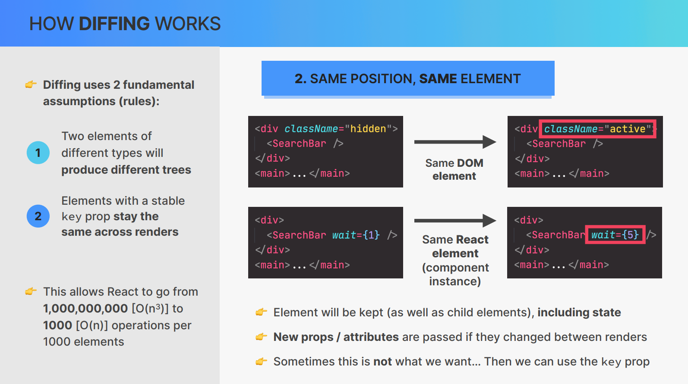


### 🐞 07.3 Issues:

| Issue | Status | Log/Error |
| ----- | ------ | --------- |
| **Missing keys on Tab components affects diffing efficiency** | ⚠️ Identified | `src/components/Tabbed.tsx:17-20` - The `Tab` components don't have explicit `key` props. React uses position-based diffing, which works but is less efficient. If tabs were ever reordered dynamically, React would incorrectly match elements by position, potentially causing state bugs or unnecessary re-renders. Explicit keys (`key={num}`) would enable key-based diffing, improving performance and correctness. |
| **Conditional rendering causes element type change, losing state** | ⚠️ Identified | `src/components/Tabbed.tsx:23` - Switching between `<TabContent />` and `<DifferentContent />` causes React's diffing algorithm to detect different element types at the same position. React unmounts `TabContent` and mounts `DifferentContent`, losing all state (`likes`, `showDetails`). While this is expected behavior, it demonstrates how diffing treats different element types, but could be optimized by using a single component with conditional content. |
| **Inline function creation causes unnecessary diffing comparisons** | ⚠️ Identified | `src/components/Tab.tsx:9` - The `onClick={() => onClick(num)}` creates a new function reference on every render. During diffing, React compares props and detects that `onClick` prop has changed (new function reference), even though the function behavior is identical. This causes React to always update the `onClick` prop during reconciliation, even when it's unnecessary. Using `useCallback` would provide a stable reference. |
| **setActiveTab function reference passed directly may cause diffing issues** | ⚠️ Identified | `src/components/Tabbed.tsx:17-20` - The `setActiveTab` function from `useState` is passed directly to all `Tab` components. While the reference is stable, if `Tab` components were memoized with `React.memo`, any change in the function reference would cause diffing to detect prop changes and trigger unnecessary re-renders. Wrapping in `useCallback` would ensure stable reference for diffing. |
| **content.at() may cause diffing confusion with undefined values** | ⚠️ Identified | `src/components/Tabbed.tsx:23` - Using `content.at(activeTab)` can return `undefined` if the index is out of range. During diffing, React compares the `item` prop, and `undefined` vs a `ContentItem` object would be detected as a prop change, potentially causing unnecessary re-renders or diffing confusion. Direct array access with proper validation would be more predictable for React's diffing algorithm. |
| **TabContent re-renders on every parent re-render despite same props** | ⚠️ Identified | `src/components/Tabbed.tsx:23` - `TabContent` re-renders every time `Tabbed` re-renders, even if the `item` prop reference hasn't changed. During diffing, React compares props and may detect changes (e.g., if `content` array is recreated), causing unnecessary Virtual DOM creation and diffing work. `React.memo` would prevent diffing when props haven't changed. |
| **No demonstration of key-based diffing vs position-based diffing** | ℹ️ Low Priority | The project doesn't include examples showing the difference between key-based diffing (with explicit keys) and position-based diffing (without keys). Adding a dynamic list example would demonstrate how keys help React correctly identify elements during diffing, especially when items are reordered. |
| **Missing explanation of shallow prop comparison in diffing** | ℹ️ Low Priority | The code doesn't demonstrate or explain that React uses shallow comparison for props during diffing. If `item` prop contained nested objects that changed, React's diffing would detect the change even if the object reference stayed the same. Adding examples would help developers understand when to use `useMemo` for props. |
| **Tab components create new React Elements on every render** | ⚠️ Identified | `src/components/Tabbed.tsx:17-20` - All 4 `Tab` components create new React Elements on every `Tabbed` re-render, even when their props haven't changed. During diffing, React compares these new Elements with the Fiber tree, which is necessary but creates overhead. `React.memo` would prevent creating new Elements when props are unchanged, reducing diffing work. |
| **No demonstration of diffing behavior with moved elements** | ℹ️ Low Priority | The project doesn't show how React's diffing algorithm handles elements that change position in a list. If tabs were dynamically reordered, React's position-based diffing (without keys) would incorrectly match elements, potentially causing state to be associated with wrong components. Adding a reorderable list example would demonstrate this. |
| **DifferentContent component type change triggers full unmount/mount** | ⚠️ Identified | `src/components/Tabbed.tsx:23` - When switching to `DifferentContent`, React's diffing detects a different element type and unmounts the entire `TabContent` subtree. This is correct behavior but demonstrates how diffing treats different element types. The component could be optimized to use conditional rendering within a single component type to preserve state if needed. |
| **Missing key prop documentation for diffing optimization** | ℹ️ Low Priority | The project doesn't include comments or documentation explaining why keys are important for React's diffing algorithm. Adding comments explaining how keys help React identify elements during diffing would help developers understand this optimization technique. |

### 🧱 07.4 Pending Fixes (TODO)

- [ ] Add explicit `key` props to `Tab` components in `Tabbed.tsx` (lines 17-20) - Use `key={num}` to enable key-based diffing instead of position-based diffing, improving performance and correctness (`src/components/Tabbed.tsx`)
- [ ] Wrap `setActiveTab` in `useCallback` in `Tabbed.tsx` to provide stable function reference for diffing comparisons (`src/components/Tabbed.tsx:12`)
- [ ] Replace inline arrow function in `Tab.tsx` onClick with a memoized handler using `useCallback` to prevent new function references on every render, reducing unnecessary diffing comparisons (`src/components/Tab.tsx:9`)
- [ ] Add `React.memo` to `Tab.tsx` component to prevent creating new React Elements when props haven't changed, reducing diffing work (`src/components/Tab.tsx:7`)
- [ ] Add `React.memo` to `TabContent.tsx` with custom comparison function to prevent diffing when `item` prop reference is the same (`src/components/TabContent.tsx:7`)
- [ ] Replace `content.at(activeTab)` with `content[activeTab]` and add proper null checking to improve diffing predictability and avoid undefined prop comparisons (`src/components/Tabbed.tsx:23`)
- [ ] Create a demonstration component showing key-based vs position-based diffing - Add a `DiffingDemo.tsx` component that shows how keys help React correctly identify elements when items are reordered
- [ ] Add comments explaining diffing behavior in `Tabbed.tsx` - Document how React's diffing algorithm compares elements when switching tabs and when switching between `TabContent` and `DifferentContent`
- [ ] Create example demonstrating shallow prop comparison - Add code showing how React's diffing uses shallow comparison for props and when `useMemo` is needed for nested objects
- [ ] Add documentation on element type changes - Explain in comments how React's diffing treats different element types (unmount/mount) vs same element types (update props)
- [ ] Optimize conditional rendering pattern - Consider using a single component with conditional content instead of switching between `TabContent` and `DifferentContent` to avoid element type changes during diffing (if state preservation is desired)
- [ ] Add React DevTools diffing inspection guide - Include instructions on how to use React DevTools to observe diffing behavior and see which elements are being compared
- [ ] Create a comparison component showing diffing with and without keys - Add a `KeyComparisonDemo.tsx` that demonstrates how keys affect React's diffing when list items are reordered
- [ ] Document diffing performance implications - Add comments explaining how diffing overhead increases with component tree size and how optimization techniques reduce diffing work

<br>

## 🔧 08. Lesson 130 — _Diffing Rules in Practice_

### 🧠 08.1 Context:

**Diffing Rules in Practice** is a practical demonstration lesson that shows how React's diffing algorithm behaves in real-world scenarios. This lesson builds upon the theoretical understanding from Lesson 129 by providing concrete examples of how React preserves or resets component state based on element type and position during reconciliation. Understanding these practical rules is crucial because they directly impact user experience, state management decisions, and component architecture choices.

#### Definition and Purpose

**Diffing Rules in Practice** refers to the observable behavior of React's reconciliation algorithm when components are rendered conditionally or when switching between different component types. The key practical rule is: **React preserves component state when the same element type remains at the same position in the component tree, and resets state when different element types are rendered at the same position.**

**Key Principle**: React's diffing algorithm uses **element type and position** to decide whether to:
1. **Reuse** a component instance (preserving state) - when element type and position match
2. **Replace** a component instance (resetting state) - when element type differs at the same position

#### When These Rules Apply

These practical diffing rules manifest in several scenarios:

1. **Conditional Rendering**: When switching between different components based on conditions
2. **Tab Navigation**: When different tabs show different content components
3. **Dynamic Component Switching**: When user interactions change which component is rendered
4. **State Preservation**: When you want state to persist across prop changes
5. **State Reset**: When you want state to reset when switching contexts

**Example from the Project** (`src/components/Tabbed.tsx`):
```11:24:src/components/Tabbed.tsx
function Tabbed({ content }: TabbedProps) {
  const [activeTab, setActiveTab] = useState(0);

  return (
    <div>
      <div className="tabs">
        <Tab num={0} activeTab={activeTab} onClick={setActiveTab} />
        <Tab num={1} activeTab={activeTab} onClick={setActiveTab} />
        <Tab num={2} activeTab={activeTab} onClick={setActiveTab} />
        <Tab num={3} activeTab={activeTab} onClick={setActiveTab} />
      </div>

      {activeTab <= 2 ? <TabContent item={content.at(activeTab)} /> : <DifferentContent />}
    </div>
  );
}
```

#### Practical Rule 1: Same Element Type, Same Position = State Preserved

When React encounters the **same element type** at the **same position** in the component tree, it reuses the component instance and preserves all internal state.

**Example from the Project**:

**Scenario**: User hides details and clicks "+" three times in Tab 1, then switches to Tab 2 and Tab 3.

**What Happens**:
- **Tab 1**: `TabContent` renders with `showDetails: false` and `likes: 3`
- **Tab 2**: React compares elements at the same position:
  - Element type: `TabContent` === `TabContent` ✅ (same type)
  - Position: Same position in tree ✅
  - **Result**: React **reuses** the `TabContent` instance
  - **State preserved**: `showDetails: false`, `likes: 3` remain unchanged
  - Only the `item` prop changes (from `content[0]` to `content[1]`)
- **Tab 3**: Same behavior - state continues to be preserved

**Code Evidence** (`src/components/TabContent.tsx`):
```7:9:src/components/TabContent.tsx
function TabContent({ item }: TabContentProps) {
  const [showDetails, setShowDetails] = useState(true);
  const [likes, setLikes] = useState(0);
```

The `useState` hooks maintain their values across renders because React recognizes `TabContent` as the same component instance at the same position, even though the `item` prop changes.

**Why This Happens**:
- React's diffing algorithm compares element types first
- Same type at same position → React updates props and reuses Fiber node
- Component instance is preserved → State in Fiber tree is preserved
- Only props are updated → Component re-renders with new props but same state

#### Practical Rule 2: Different Element Type, Same Position = State Reset

When React encounters a **different element type** at the **same position**, it unmounts the old component and mounts a new one, completely resetting state.

**Example from the Project**:

**Scenario**: User interacts with Tab 2 (state: `showDetails: false`, `likes: 3`), then clicks Tab 4.

**What Happens**:
- **Before (Tab 2)**: `<TabContent item={content[2]} />` is rendered
- **After (Tab 4)**: `<DifferentContent />` is rendered at the same position
- React compares elements:
  - Element type: `TabContent` !== `DifferentContent` ❌ (different type)
  - Position: Same position in tree ✅
  - **Result**: React **unmounts** `TabContent` and **mounts** `DifferentContent`
  - **State lost**: All `TabContent` state (`showDetails`, `likes`) is destroyed
  - **New instance**: `DifferentContent` is a fresh component with no state

**Code Evidence** (`src/components/Tabbed.tsx`):
```23:23:src/components/Tabbed.tsx
{activeTab <= 2 ? <TabContent item={content.at(activeTab)} /> : <DifferentContent />}
```

When `activeTab` changes from 2 to 3:
- Conditional expression changes from `true` to `false`
- React element type changes from `TabContent` to `DifferentContent`
- React's diffing detects different element types
- React performs unmount → mount cycle

**When User Returns to Tab 2**:
- **Before (Tab 4)**: `<DifferentContent />` is rendered
- **After (Tab 2)**: `<TabContent item={content[2]} />` is rendered
- React compares elements:
  - Element type: `DifferentContent` !== `TabContent` ❌ (different type)
  - **Result**: React unmounts `DifferentContent` and mounts a **new** `TabContent` instance
  - **State reset**: The new `TabContent` instance starts with default state (`showDetails: true`, `likes: 0`)

**Why This Happens**:
- React's diffing algorithm treats different element types as incompatible
- Different type at same position → React destroys old Fiber node and creates new one
- Component instance is destroyed → All state is lost
- New component instance → Fresh state initialization

#### Practical Implications

**1. State Preservation Across Prop Changes**:

When the same component type receives different props, state is preserved:

```tsx
// Tab 1 → Tab 2: State preserved
<TabContent item={content[0]} />  // showDetails: false, likes: 3
<TabContent item={content[1]} />  // showDetails: false, likes: 3 (preserved!)
```

**2. State Reset on Component Type Change**:

When component type changes, state is reset:

```tsx
// Tab 2 → Tab 4: State lost
<TabContent item={content[2]} />  // showDetails: false, likes: 3
<DifferentContent />              // No state (new component)

// Tab 4 → Tab 2: State reset
<DifferentContent />              // No state
<TabContent item={content[2]} />  // showDetails: true, likes: 0 (reset!)
```

**3. Position Matters**:

React compares elements at the same position in the tree. The position is determined by the parent component's render structure:

```tsx
// Same position in tree
<div>
  {condition ? <ComponentA /> : <ComponentB />}  // Position: child[0]
</div>
```

#### Advantages

- **Predictable Behavior**: Understanding these rules helps predict when state will be preserved or reset
- **State Management Clarity**: Makes it clear when to lift state up vs. keeping it local
- **Performance Optimization**: Reusing component instances is more efficient than creating new ones
- **User Experience Control**: Allows intentional state preservation or reset based on component structure
- **Debugging Aid**: Explains why state sometimes persists unexpectedly or resets unexpectedly

#### Disadvantages

- **Unexpected State Persistence**: State can persist when switching between tabs/content, which might not be desired
- **Unexpected State Loss**: State can be lost when component types change, which can surprise users
- **Position Dependency**: State preservation depends on component position, which can be fragile
- **No Fine-Grained Control**: Cannot selectively preserve some state while resetting others without lifting state up
- **Learning Curve**: Requires understanding of React's reconciliation to predict behavior

#### When to Consider Alternatives

- **Lift State Up**: When you want state to persist across different component types, lift state to a common parent
- **Single Component with Conditional Content**: Instead of switching component types, use one component with conditional rendering inside
- **Keys for Lists**: Use keys when rendering lists to control which components are reused
- **State Management Libraries**: For complex state that needs to persist across component changes, consider Context API or external state management
- **Component Composition**: Structure components to minimize element type changes when state preservation is important

#### Connection to Main Theme

This lesson demonstrates:

- **Practical Application**: Shows how diffing theory from Lesson 129 works in real code
- **State Lifecycle**: Explains when component instances are created, reused, or destroyed
- **User Experience Impact**: Shows how diffing rules directly affect what users see
- **Architecture Decisions**: Guides when to structure components for state preservation vs. reset
- **Debugging Knowledge**: Helps understand why state behaves the way it does in practice

**Practical Example from the Project**:

The tabbed interface demonstrates both rules:

1. **State Preservation** (Tabs 1-3): All use `TabContent`, so state persists when switching between them
2. **State Reset** (Tab 4): Uses `DifferentContent`, so state is lost when switching to/from Tab 4

This practical demonstration makes the abstract concept of diffing concrete and observable, helping developers understand when and why state is preserved or reset in their applications.

### ⚙️ 08.2 Updating code according the context:

#### 08.2.1 Hide the text then click three times on `+` in order to increase the heart amount.

* In tab 1:
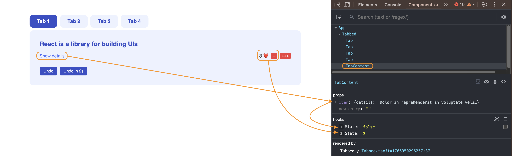

* In tab 2:
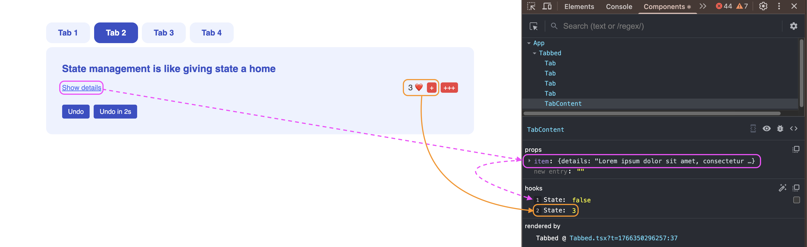

* In tab 3:
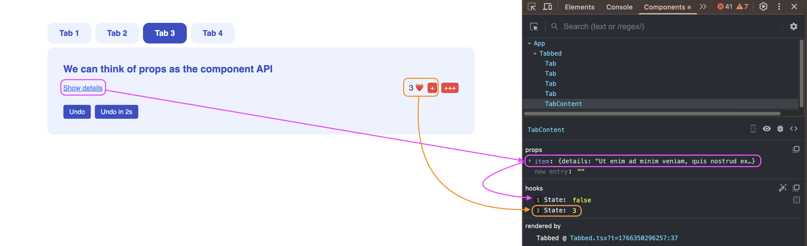


> `TabContent` states keep the same through different `Tab` changing:
- 1 State: false
- 2 State: 3

> `TabContent` always stays in the exact component position in the tree.
- its states are precerve across renders
- The only thing that changes is the `props` that it receives.

#### 08.2.2 What happen when click on `Tab 4`:

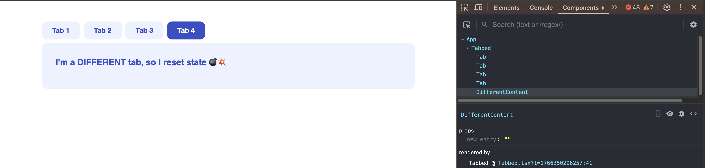
We've got different component is rendered in the same position in the tree. It's no longer `TabContent` but `DifferentContent` component.

> When user goes back and clicks on `Tab 2` for instance:
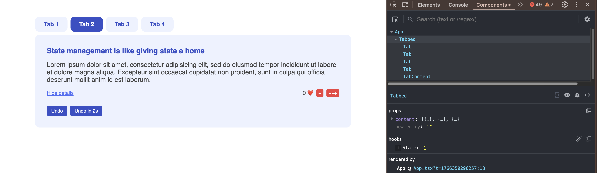
`Tab Content` statuses are reset.

### 🐞 08.3 Issues:

| Issue | Status | Log/Error |
| ----- | ------ | --------- |
| **Typo in comment: "DiffernetContent" should be "DifferentContent"** | ⚠️ Identified | `docs/LECTURE_STEPS.md:1963` - The documentation contains a typo: "DiffernetContent" instead of "DifferentContent". This is a spelling error that should be corrected for clarity and professionalism. |
| **State preservation behavior may be unexpected for users** | ⚠️ Identified | `src/components/Tabbed.tsx:23` - When users switch between Tabs 1-3, the `TabContent` state (likes count, showDetails toggle) persists across tabs. While this demonstrates diffing rules correctly, it may create unexpected UX where state from one tab appears in another tab. Users might expect each tab to have independent state. This is a design consideration rather than a bug, but worth documenting. |
| **State reset when switching to Tab 4 may confuse users** | ⚠️ Identified | `src/components/Tabbed.tsx:23` - When users interact with Tabs 1-3 (e.g., hide details, increment likes) and then switch to Tab 4, all state is lost. When they return to Tabs 1-3, the state is reset to defaults. This demonstrates diffing rules (different component types reset state), but users might find this behavior confusing if they expect their interactions to persist. Consider adding user feedback or documentation about this behavior. |
| **Missing user feedback about state preservation/reset** | ⚠️ Identified | `src/components/Tabbed.tsx:23` - The application doesn't provide any visual indication or explanation to users about why state persists across Tabs 1-3 but resets when switching to Tab 4. While this is intentional for educational purposes, it could benefit from a comment or visual indicator explaining the diffing behavior. |
| **Hardcoded tab count logic limits extensibility** | ℹ️ Low Priority | `src/components/Tabbed.tsx:23` - The condition `activeTab <= 2` is hardcoded, assuming exactly 3 content tabs (0, 1, 2) and 1 different tab (3). If the `content` array length changes, this logic would need manual updates. A more dynamic approach using `activeTab < content.length` would make the component more flexible. |

### 🧱 08.4 Pending Fixes (TODO)

- [ ] Fix typo in documentation: Change "DiffernetContent" to "DifferentContent" in `docs/LECTURE_STEPS.md:1963`
- [ ] Consider adding user feedback mechanism to explain state preservation behavior when switching between Tabs 1-3 (e.g., tooltip or info message explaining that state persists because same component type is used)
- [ ] Consider adding visual indicator or warning when switching to Tab 4 that explains state will be reset (e.g., "Switching to Tab 4 will reset your current tab's state")
- [ ] Evaluate if state should be lifted up to `Tabbed` component to provide independent state per tab, or if current behavior (demonstrating diffing rules) is intentional for educational purposes
- [ ] Refactor hardcoded `activeTab <= 2` condition in `src/components/Tabbed.tsx:23` to use dynamic `activeTab < content.length` for better extensibility
- [ ] Add comments in `src/components/Tabbed.tsx` explaining the diffing behavior: why state persists across Tabs 1-3 and resets with Tab 4
- [ ] Consider adding a reset button or clear state functionality to allow users to manually reset tab state if needed

<br>

## 🔧 09. Lesson 131 — _The Key Prop_:

### 🧠 09.1 Context:

The **`key` prop** is a special React attribute that helps React identify which items have changed, been added, or removed from a list. It's also used to force React to reset component state by changing the key value.

#### Definition and Explanation

The `key` prop serves two main purposes:

1. **List Reconciliation**: When rendering lists of elements, React uses keys to efficiently identify which elements correspond to which items in the data array. This allows React to minimize DOM operations when items are added, removed, or reordered.

2. **State Reset**: By changing a component's `key` value, React treats it as a completely new component instance, forcing it to unmount the old instance and mount a new one, which resets all internal state.

#### When It Occurs/Is Used

**Keys in Lists**:
- **Required** when rendering arrays of elements using `.map()`, `.filter()`, or similar array methods
- React uses keys to match elements between renders
- Without keys, React relies on element position, which can cause bugs when list order changes

**Keys for State Reset**:
- Used when you want to force a component to reset its state
- Changing the `key` prop value tells React to destroy the old component instance and create a new one
- Useful when switching between different data sources or when you want to reset form state

#### Examples from the Project

**Current Implementation Without Keys** (`src/components/Tabbed.tsx`):
```17:20:src/components/Tabbed.tsx
<Tab num={0} activeTab={activeTab} onClick={setActiveTab} />
<Tab num={1} activeTab={activeTab} onClick={setActiveTab} />
<Tab num={2} activeTab={activeTab} onClick={setActiveTab} />
<Tab num={3} activeTab={activeTab} onClick={setActiveTab} />
```
Currently, `Tab` components are rendered manually without `key` props. While this works, adding explicit keys would improve reconciliation clarity.

**State Persistence Issue** (`src/components/Tabbed.tsx:23`):
```23:23:src/components/Tabbed.tsx
{activeTab <= 2 ? <TabContent item={content.at(activeTab)} /> : <DifferentContent />}
```
The `TabContent` component maintains its state (`likes`, `showDetails`) when switching between tabs because React sees it as the same component instance. To reset state when switching tabs, we could use a `key` prop tied to `activeTab`.

**Potential List Rendering** (if refactored to use `.map()`):
If the tabs were rendered from an array, keys would be essential:
```tsx
tabs.map((tab, index) => <Tab key={tab.id} num={index} ... />)
```

#### Advantages

- **Efficient Reconciliation**: Helps React identify which elements changed, reducing unnecessary DOM updates
- **Prevents State Bugs**: Ensures correct state association with list items when order changes
- **State Reset Control**: Provides a simple way to reset component state without lifting state up
- **Performance**: Improves rendering performance for dynamic lists
- **Predictable Behavior**: Makes component lifecycle predictable when keys change

#### Disadvantages

- **Must Be Unique**: Keys must be unique among siblings, which can be challenging with dynamic data
- **Must Be Stable**: Keys should remain stable across renders (not use array indices if order changes)
- **Not Accessible in Component**: Keys are not passed as props to components - they're used internally by React
- **Overuse Can Cause Issues**: Changing keys unnecessarily can cause performance problems and unexpected unmounts
- **Learning Curve**: Requires understanding when to use stable vs. changing keys

#### When to Consider Alternatives

- **Lift State Up**: If you need state to persist across key changes, lift state to a parent component
- **Controlled Components**: For forms, consider controlled components with explicit state management instead of relying on key changes
- **State Management Libraries**: For complex state reset scenarios, consider Context API or external state management
- **Component Composition**: Sometimes restructuring components is better than using keys to reset state
- **Stable Keys for Lists**: Always use stable, unique identifiers (like IDs from database) rather than array indices when list order can change

#### Connection to Main Theme

This lesson demonstrates:

- **Practical Application**: Shows how `key` prop affects React's reconciliation algorithm
- **State Lifecycle Control**: Explains how to control when components are created, reused, or destroyed
- **List Rendering Best Practices**: Guides proper use of keys in dynamic lists
- **State Reset Pattern**: Demonstrates a common pattern for resetting component state
- **Performance Optimization**: Shows how keys improve React's rendering efficiency

**Practical Example from the Project**:

The current tabbed interface could benefit from `key` prop in two ways:

1. **Adding keys to Tab components** for better reconciliation:
```tsx
<Tab key={0} num={0} ... />
<Tab key={1} num={1} ... />
```

2. **Using key on TabContent to reset state** when switching tabs:
```tsx
<TabContent key={activeTab} item={content.at(activeTab)} />
```
This would reset `likes` and `showDetails` state each time the user switches tabs, providing independent state per tab.

### ⚙️ 09.2 Updating code according the context:

#### 09.2.1 What is the **key** prop?

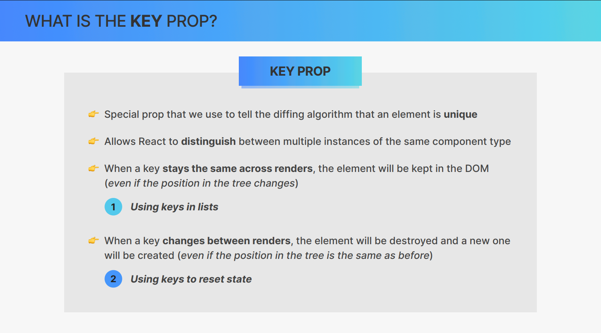

The `key` prop is a special string attribute that React uses to identify elements in lists. It helps React determine which items have changed, been added, or removed, enabling efficient updates to the DOM.

#### 09.2.2 Keys in **lists** [Stable Key]

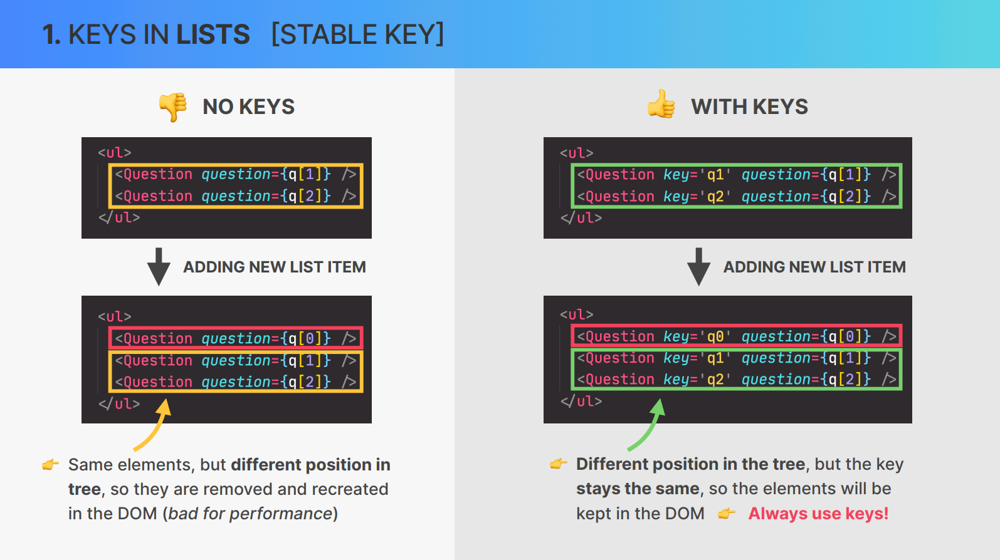

When rendering lists, keys should be:
- **Unique**: Each key must be unique among siblings
- **Stable**: Keys should remain the same across renders for the same item
- **Predictable**: Keys should be based on the item's identity, not its position

**Example**: If we refactored `Tabbed` to render tabs from an array:
```tsx
const tabs = [0, 1, 2, 3];
return (
  <div className="tabs">
    {tabs.map((num) => (
      <Tab key={num} num={num} activeTab={activeTab} onClick={setActiveTab} />
    ))}
  </div>
);
```

#### 09.2.3 Key Prop to **Reset State** [Changing Key]

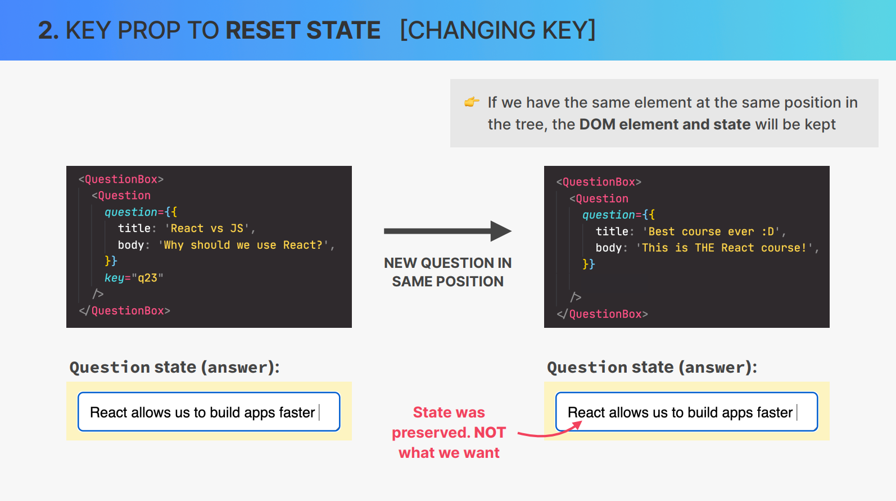

By changing a component's `key` value, React treats it as a completely new component instance. This causes:
- The old instance to unmount (state is lost)
- A new instance to mount (state is reset to initial values)

This is useful when you want to reset component state without lifting state up to a parent.

#### 09.2.4 Key Prop to **Reset State** [Changing Key] - example:

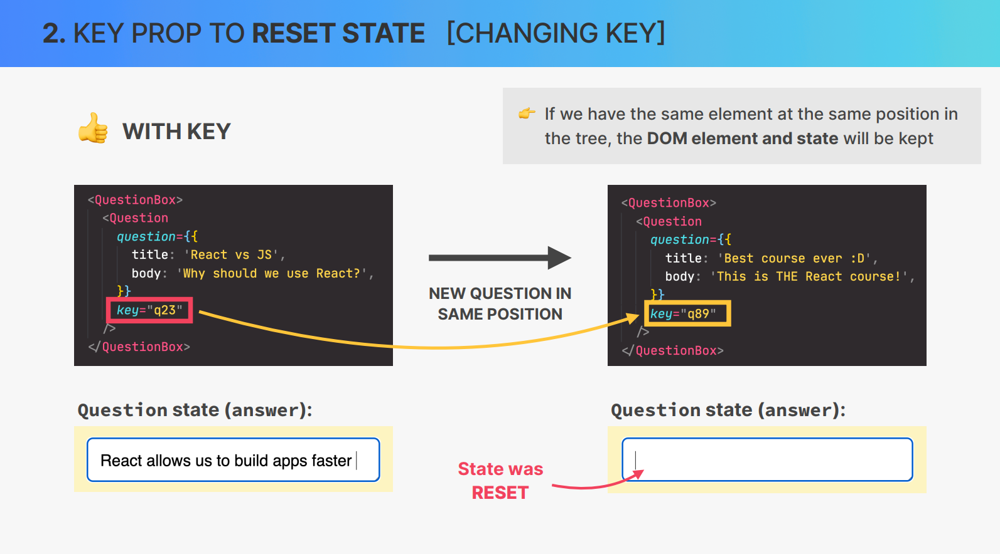

**Current Implementation** (`src/components/Tabbed.tsx:23`):
```tsx
{activeTab <= 2 ? <TabContent item={content.at(activeTab)} /> : <DifferentContent />}
```

**Updated Implementation with Key Prop**:
```tsx
{activeTab <= 2 ? (
  <TabContent key={activeTab} item={content.at(activeTab)} />
) : (
  <DifferentContent />
)}
```

**What This Changes**:
- When `activeTab` changes from 0 to 1, React sees `key={0}` → `key={1}`
- React unmounts the old `TabContent` instance (with its `likes` and `showDetails` state)
- React mounts a new `TabContent` instance with fresh state
- Each tab now has independent state, resetting when switching tabs

**Before**: State persists across tabs (likes count, showDetails toggle remain)
**After**: State resets when switching tabs (each tab starts fresh)

### 🐞 09.3 Issues:

| Issue | Status | Log/Error |
| ----- | ------ | --------- |
| **Missing key prop on Tab components affects reconciliation** | ⚠️ Identified | `src/components/Tabbed.tsx:17-20` - The `Tab` components don't have explicit `key` props. While React can reconcile them by position (since they're rendered in a fixed order), explicit keys (`key={num}`) would help React identify instances correctly during reconciliation, especially if the tab order ever changes dynamically or if tabs are conditionally rendered. This is a best practice for list-like rendering. |
| **TabContent state persists across tabs without user control** | ⚠️ Identified | `src/components/Tabbed.tsx:23` - The `TabContent` component maintains its internal state (`likes`, `showDetails`) when switching between tabs because React sees it as the same component instance. Users might expect each tab to have independent state. Adding `key={activeTab}` to `TabContent` would reset state when switching tabs, providing independent state per tab. |
| **No mechanism to reset TabContent state without key prop** | ⚠️ Identified | `src/components/TabContent.tsx:8-9` - The component's state (`showDetails`, `likes`) can only be reset by unmounting the component. Currently, this only happens when switching to Tab 4 (which renders `DifferentContent`). There's no way to reset state when switching between Tabs 1-3 without using a `key` prop or lifting state up. |
| **Potential reconciliation issues if tabs are rendered dynamically** | ℹ️ Low Priority | `src/components/Tabbed.tsx:17-20` - If the tabs were refactored to be rendered from an array using `.map()`, missing keys would cause React warnings and potential reconciliation bugs. While current implementation is manual and doesn't require keys, future refactoring should include keys. |
| **Hardcoded tab rendering prevents using array.map() with keys** | ℹ️ Low Priority | `src/components/Tabbed.tsx:17-20` - Tabs are manually rendered instead of using `.map()` over an array. This prevents demonstrating proper key usage in lists. Refactoring to use `.map()` would allow proper key implementation and demonstrate list rendering best practices. |

### 🧱 09.4 Pending Fixes (TODO)

- [ ] Add explicit `key` props to `Tab` components in `src/components/Tabbed.tsx:17-20` (e.g., `key={num}`) to improve reconciliation clarity and follow React best practices
- [ ] Add `key={activeTab}` prop to `TabContent` component in `src/components/Tabbed.tsx:23` to reset state when switching between tabs, providing independent state per tab
- [ ] Consider refactoring tab rendering in `src/components/Tabbed.tsx:17-20` to use `.map()` method with proper keys, demonstrating list rendering best practices: `tabs.map((num) => <Tab key={num} num={num} ... />)`
- [ ] Add comments explaining the purpose of `key` prop in `src/components/Tabbed.tsx` when implementing keys (both for list reconciliation and state reset)
- [ ] Test state reset behavior after adding `key={activeTab}` to `TabContent` to ensure state properly resets when switching tabs
- [ ] Document the difference between state persistence (current behavior) and state reset (with key prop) in component comments or documentation

<br>

## 🔧 10. Lesson 132 — _Resetting State With the Key Prop_

### 🧠 10.1 Context:

**Resetting State With the Key Prop** is a React pattern that uses the `key` prop to force React to treat a component as a completely new instance, thereby resetting all its internal state to initial values.

#### Definition and Explanation

When you change a component's `key` prop value, React's reconciliation algorithm detects this change and treats it as a signal that the component should be completely replaced rather than updated. This causes:

1. **Unmounting**: The old component instance is unmounted, destroying all its internal state
2. **Mounting**: A new component instance is mounted with fresh initial state
3. **State Reset**: All `useState` hooks, `useRef` values, and other component state are reset to their initial values

#### When It Occurs/Is Used

**Common Use Cases**:

- **Form Reset**: When switching between different forms or data sources, you want each form to start with clean state
- **Tab Navigation**: When each tab should have independent state that resets when switching tabs
- **Data Source Changes**: When displaying different entities (e.g., user profiles) and you want to reset state when switching between them
- **Conditional Rendering**: When you want to ensure state doesn't persist across different render conditions

**In This Project** (`src/components/Tabbed.tsx:27`):

```27:27:src/components/Tabbed.tsx
<TabContent item={currentItem} key={currentItem.summary} />
```

The `key` prop is set to `currentItem.summary`, which means:
- When switching from Tab 1 to Tab 2, if the summaries are different, React resets `TabContent` state
- The `likes` counter and `showDetails` toggle reset to their initial values (`likes: 0`, `showDetails: true`)
- Each tab with a unique summary gets a fresh component instance

#### Examples from the Project

**Before Using Key Prop** (hypothetical):
```tsx
// Without key prop - state persists across tabs
<TabContent item={currentItem} />
// Switching Tab 1 → Tab 2: likes count and showDetails state are preserved
```

**After Using Key Prop** (`src/components/Tabbed.tsx:27`):
```tsx
// With key prop - state resets when key changes
<TabContent item={currentItem} key={currentItem.summary} />
// Switching Tab 1 → Tab 2: React sees different key → unmounts old → mounts new → state resets
```

**State Reset Behavior**:
- **Tab 1**: User sets `likes` to 5 and hides details (`showDetails: false`)
- **Switch to Tab 2**: `key` changes from `"React is a library for building UIs"` to `"State management is like giving state a home"`
- **Result**: React unmounts Tab 1's `TabContent` and mounts Tab 2's `TabContent` with fresh state (`likes: 0`, `showDetails: true`)

#### Advantages

- **Simple State Reset**: Provides an easy way to reset component state without lifting state up to parent components
- **Independent State Per Instance**: Each component instance maintains its own independent state
- **No Manual State Management**: Avoids the need to manually reset state values or create reset functions
- **Predictable Behavior**: Makes it clear when state will reset (whenever the key changes)
- **Clean Component Design**: Allows components to manage their own state while still providing reset capability

#### Disadvantages

- **Performance Overhead**: Unmounting and remounting components is more expensive than updating props
- **Loss of User Data**: Users lose their input/interactions when switching (e.g., form data, scroll position)
- **No State Preservation**: Cannot preserve state across key changes (if that's desired)
- **Potential UX Issues**: Unexpected state resets can frustrate users who expect their interactions to persist
- **Key Stability**: If keys are not stable or unique, it can cause unnecessary remounts or bugs

#### When to Consider Alternatives

**Consider Lifting State Up** when:
- You want to preserve state across different component instances
- Multiple components need to share the same state
- You need fine-grained control over when state resets

**Consider Manual State Reset** when:
- You want to reset only specific state values, not all state
- You need to reset state based on user actions (e.g., a "Reset" button) rather than component remounting
- Performance is critical and you want to avoid unmounting/remounting overhead

**Consider Using `useEffect` with Dependencies** when:
- You want to reset state when specific props change, but keep the same component instance
- You need to perform side effects when resetting state

**In This Project Context**:

The use of `key={currentItem.summary}` provides independent state per tab, which is appropriate for this educational example. However, in a real-world application, you might want to consider:
- Whether users expect their interactions (likes, show/hide preferences) to persist when switching tabs
- If the performance cost of remounting is acceptable
- Whether lifting state to the parent (`Tabbed`) component would provide better UX

### ⚙️ 10.2 Updating code according the context:

#### 10.2.1 Adding `key` as prop in `TabContent`:

```tsx
/* src/components/Tabbed.tsx */
import { useState } from "react";
import DifferentContent from "./DifferentContent";
import Tab from "./Tab";
import TabContent from "./TabContent";
import type { ContentItem } from "../App";
interface TabbedProps {
  content: ContentItem[];
}
function Tabbed({ content }: TabbedProps) {
  const [activeTab, setActiveTab] = useState(0);
  const currentItem = activeTab <= 2 ? content.at(activeTab) : undefined;  // 👈🏽 ✅
  return (
    <div>
      <div className="tabs">
        <Tab num={0} activeTab={activeTab} onClick={setActiveTab} />
        <Tab num={1} activeTab={activeTab} onClick={setActiveTab} />
        <Tab num={2} activeTab={activeTab} onClick={setActiveTab} />
        <Tab num={3} activeTab={activeTab} onClick={setActiveTab} />
      </div>
      {activeTab <= 2 ? (
        currentItem ? (
          <TabContent item={currentItem} key={currentItem.summary} /> [/* 👈🏽 ✅ */]
        ) : null
      ) : (
        <DifferentContent />
      )}
    </div>
  );
}
export default Tabbed;
```

#### 10.2.2 See its behavior switching from `tab1` to `tab3`:

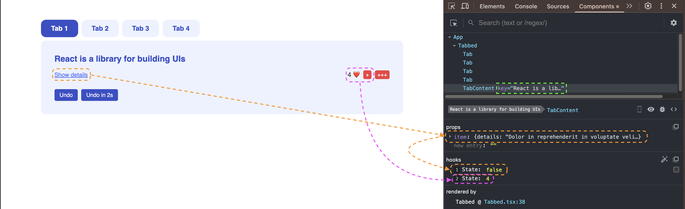
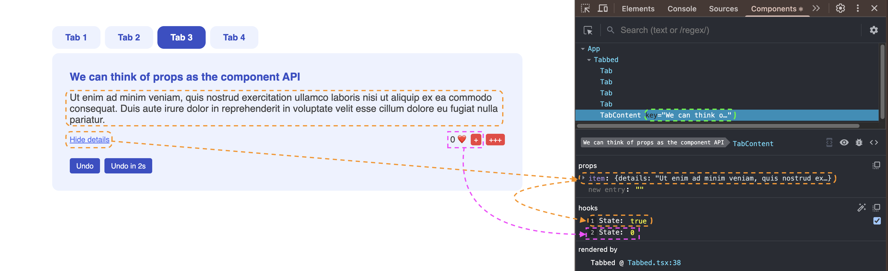

### 🐞 10.3 Issues:

| Issue | Status | Log/Error |
| ----- | ------ | --------- |
| **Using `summary` as key may cause issues if summaries are not unique** | ⚠️ Identified | `src/components/Tabbed.tsx:27` - The `key` prop uses `currentItem.summary`, which assumes all summaries are unique. If two different content items have the same summary, React will incorrectly reuse the component instance instead of creating a new one, causing state to persist when it shouldn't. Consider using `activeTab` or a unique identifier instead. |
| **Key prop resets state even when user might want to preserve it** | ⚠️ Identified | `src/components/Tabbed.tsx:27` - The current implementation resets `TabContent` state (likes, showDetails) every time the user switches tabs. This might not be desired UX - users might expect their likes count or preferences to persist when navigating between tabs. Consider whether state reset is intentional or if state should be lifted up to preserve user interactions. |
| **Potential performance impact from frequent remounting** | ℹ️ Low Priority | `src/components/Tabbed.tsx:27` - Using `key={currentItem.summary}` causes React to unmount and remount `TabContent` on every tab switch. While this is acceptable for small components, frequent remounting can impact performance in larger applications. Consider memoization or lifting state if performance becomes an issue. |
| **No visual feedback about state reset behavior** | ⚠️ Identified | `src/components/Tabbed.tsx:27` - Users might be confused when their interactions (likes, show/hide preferences) disappear when switching tabs. There's no indication that state resets occur. Consider adding user feedback (e.g., tooltip, info message) explaining the reset behavior, or provide a way to preserve state if desired. |
| **Key value depends on content data structure** | ⚠️ Identified | `src/components/Tabbed.tsx:27` - The key is derived from `currentItem.summary`, making it dependent on the content data structure. If the content structure changes or summaries are modified, the key behavior might change unexpectedly. Using `activeTab` as the key would be more stable and predictable. |

### 🧱 10.4 Pending Fixes (TODO)

- [ ] **Change key prop from `currentItem.summary` to `activeTab`** in `src/components/Tabbed.tsx:27` - Using `activeTab` as the key would be more stable, predictable, and doesn't depend on content data structure. This ensures unique keys even if summaries are duplicated.

- [ ] **Add validation to ensure content summaries are unique** - If keeping `currentItem.summary` as key, add a check in `src/App.tsx` or `src/components/Tabbed.tsx` to validate that all summaries are unique, preventing potential bugs from duplicate keys.

- [ ] **Consider lifting state up to `Tabbed` component** - Evaluate if `likes` and `showDetails` state should be managed in the parent component (`Tabbed`) to provide independent state per tab without remounting. This would preserve state when switching tabs while avoiding remount overhead.

- [ ] **Add user feedback mechanism** - Add a tooltip, info message, or visual indicator explaining that tab state resets when switching tabs. This helps users understand the behavior and sets expectations. Consider adding this near the tabs or in the `TabContent` component.

- [ ] **Add option to preserve state** - Consider adding a toggle or setting that allows users to choose whether state should reset when switching tabs or persist across tabs. This could be implemented by conditionally using the `key` prop based on user preference.

- [ ] **Document key prop behavior** - Add comments in `src/components/Tabbed.tsx:27` explaining why the `key` prop is used and what behavior it creates. This helps future developers understand the intentional state reset behavior.

- [ ] **Consider using `useMemo` or `useCallback`** - If performance becomes an issue with frequent remounting, consider optimizing the `TabContent` component with React.memo or memoizing expensive computations to reduce the impact of remounting.

- [ ] **Add unit tests for key prop behavior** - Create tests that verify state resets correctly when the key changes, ensuring the key prop behavior works as expected and doesn't regress in future changes.


---

🔥 🔥 🔥

<br>

## 🔧 XX. Lesson YYY — _{{TITLE_NAME}}_

### 🧠 XX.1 Context:

### ⚙️ XX.2 Updating code according the context:

#### XX.2.1

```tsx
/*  */
```

#### XX.2.2

```tsx
/*  */
```

### 🐞 XX.3 Issues:

- **first issue**: something..

| Issue | Status | Log/Error |
| ----- | ------ | --------- |

### 🧱 XX.4 Pending Fixes (TODO)

- [ ]

